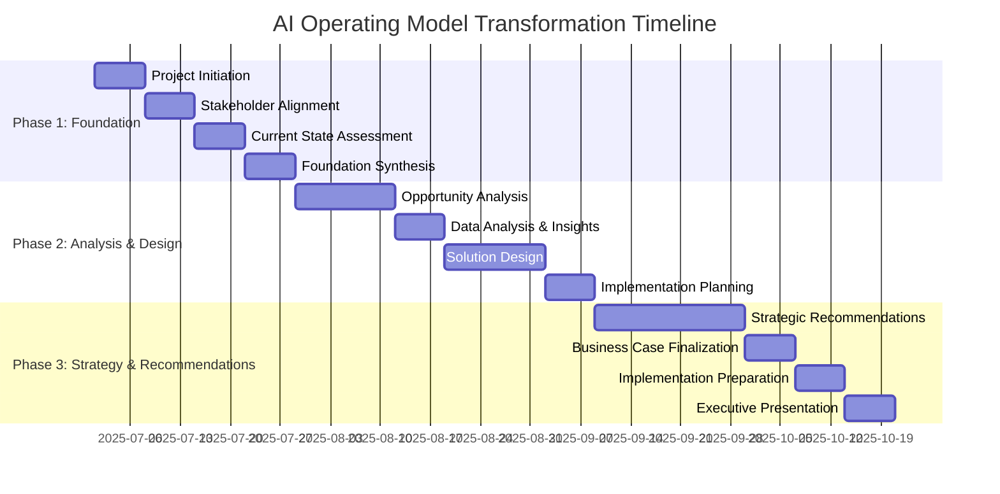

# 📅 Engagement Timeline: AI Operating Model Transformation

**Timeline Overview**: 16-week structured transformation engagement  
**Start Date**: July 1, 2025  
**End Date**: October 24, 2025  
**Resource Commitment**: 935K total investment, 12 FTE team members

---

## 🗓️ Master Timeline Overview

...

**📅 16-week journey to AI transformation success**

*Previous: [Methodology Framework](./Methodology_Framework.md) | Next: [01_Stakeholder_Alignment](../01_Stakeholder_Alignment/)*

