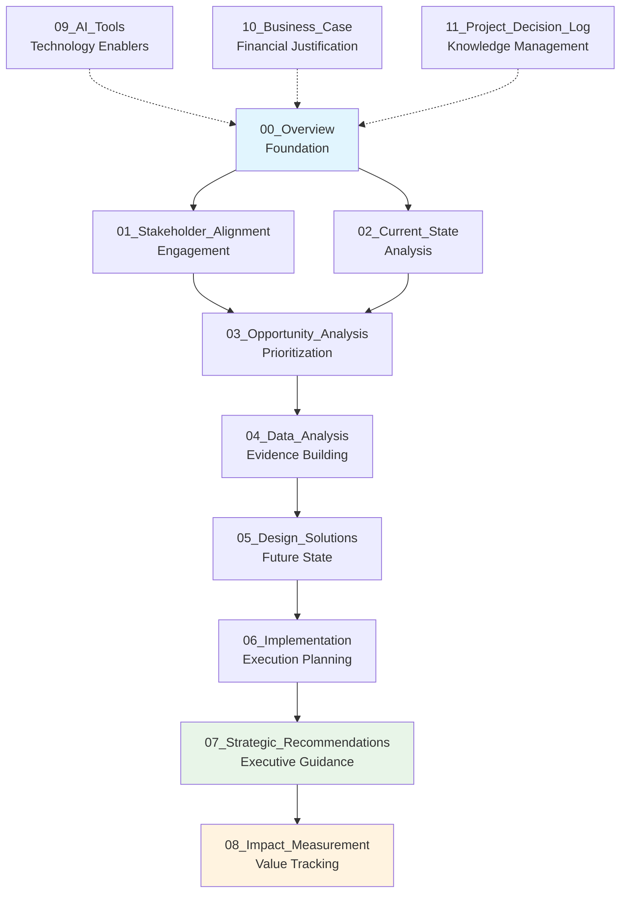

# 📋 00_Overview | Project Foundation

> **Establishing the framework and governance for AI operating model transformation**

This folder contains the foundational documents that establish the strategic context, methodology, and governance structure for the entire AI operating model transformation initiative.

---

## 📌 Phase Purpose

The **Overview phase** serves as the engagement foundation, establishing clear project parameters, methodology frameworks, and governance structures that guide the entire transformation lifecycle.

**Consulting Parallel**: *This mirrors the "Project Kickoff" phase where consultants establish engagement parameters, stakeholder alignment, and delivery frameworks.*

---

## 🎯 Phase Objectives

### **Strategic Foundation**
- Define clear transformation vision and success criteria
- Establish governance structure and decision rights
- Align stakeholders on approach and expectations

### **Methodology Framework**
- Document structured approach to AI transformation
- Define phase gates and deliverable standards
- Create measurement and tracking mechanisms

### **Engagement Setup**
- Establish project governance and escalation paths
- Define communication protocols and stakeholder touchpoints
- Create risk management and mitigation strategies

---

## 📁 Folder Contents

| Document | Purpose | Consulting Equivalent | Status |
|----------|---------|----------------------|--------|
| **[Project_Charter.md](./Project_Charter.md)** | Formal engagement scope and objectives | SOW (Statement of Work) | ✅ Complete |
| **[Methodology_Framework.md](./Methodology_Framework.md)** | Transformation approach and methodology | Consulting methodology deck | ✅ Complete |
| **[Executive_Brief.md](./Executive_Brief.md)** | High-level project summary for leadership | Executive summary slide | ✅ Complete |
| **[Engagement_Timeline.md](./Engagement_Timeline.md)** | Master timeline with key milestones | Project plan and timeline | ✅ Complete |
| **AI_Operating_Model_Framework.png** | Visual framework diagram | Strategy framework visual | ✅ Complete |

---

## 🏗️ Consulting Methodology

Our transformation approach follows a **structured consulting methodology** that mirrors best practices from leading strategy firms:

### **1. Foundation & Alignment** *(Current Phase)*
- Project charter and governance establishment  
- Stakeholder mapping and engagement strategy  
- Baseline assessment and success metrics definition

### **2. Discovery & Analysis**
- Current state process analysis  
- AI opportunity identification and prioritization  
- Data landscape assessment and capability mapping

### **3. Design & Planning**
- Future state operating model design  
- Implementation roadmap and change strategy  
- Technology architecture and integration planning

### **4. Execution & Measurement**
- Phased implementation with continuous monitoring  
- Success metrics tracking and course correction  
- Value realization and impact assessment

---

## 📊 Transformation Framework

---

## 🎯 Key Success Criteria

### **Immediate Outcomes (Weeks 1–2)**
- ✅ Executive alignment on transformation vision and scope  
- ✅ Clear governance structure with defined roles and responsibilities  
- ✅ Approved project charter with resource commitments  
- ✅ Stakeholder communication plan activated  
- ✅ Risk register established with mitigation strategies

### **Phase Completion Criteria**
- [ ] All stakeholders signed off on project charter  
- [ ] Governance bodies established and operational  
- [ ] Communication protocols tested and functional  
- [ ] Risk mitigation plans approved and resourced  
- [ ] Next phase (Stakeholder Alignment) ready to launch

---

## ⏱️ Timeline & Duration

**Duration**: Weeks 1-2  
**Key Stakeholders**: Executive Sponsors, Project Leadership, Core Team

### **Week 1**
- Project charter finalization and approval
- Stakeholder structure establishment
- Governance framework activation

### **Week 2**
- Communication plan rollout
- Risk assessment and mitigation planning
- Phase 1 transition preparation

---

## 🚨 Critical Success Factors

### **Executive Sponsorship**
- Visible, consistent leadership commitment
- Resource allocation and priority setting
- Clear decision-making authority

### **Governance Foundation**
- Well-defined roles and responsibilities
- Escalation paths and decision rights
- Communication protocols and cadence

### **Stakeholder Alignment**
- Shared understanding of transformation vision
- Commitment to resource allocation
- Agreement on success criteria and timeline

---

## 📈 Quality Assurance

### **Document Standards**
- Executive-ready formatting and presentation
- Consistent terminology and messaging
- Clear action items and decision points

### **Validation Approach**
- Executive sponsor review and approval
- Stakeholder feedback incorporation
- Legal and compliance sign-off where required

---

## 🔄 Integration with Next Phase

### **Stakeholder Alignment Preparation**
- Stakeholder mapping foundation established
- Communication channels and protocols defined
- Change readiness baseline assessment planned

### **Foundation for Success**
- Clear project scope and objectives
- Governance structure operational
- Resource commitments secured
- Risk mitigation strategies in place

---

**📋 Establishing the foundation for transformation success**

*Next: [01_Stakeholder_Alignment](../01_Stakeholder_Alignment/)*

