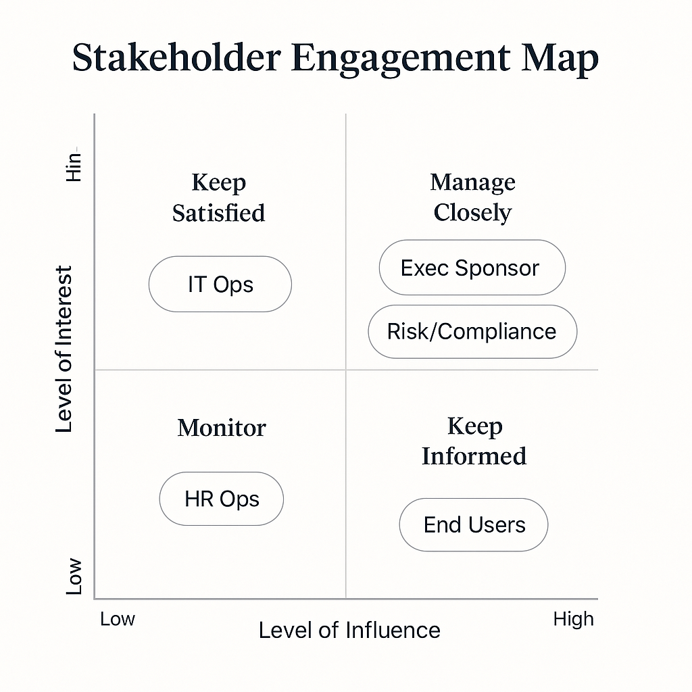

# 🤝 01_Stakeholder_Alignment

This folder outlines the engagement strategy for aligning key stakeholders in the AI Operating Model Transformation initiative. The goal is to proactively manage expectations, minimize resistance, and ensure executive sponsorship and team-level adoption from the start.

---

## 🔍 Folder Contents

| File                                | Description                                           |
|-------------------------------------|-------------------------------------------------------|
| `Stakeholder_Engagement_Map.png`   | Visual quadrant mapping influence vs interest         |
| `Stakeholder_Map.xlsx`             | Source file for stakeholder classification            |
| `Communication_Plan_Template.docx` | Framework for targeted messaging and outreach cadence |
| `RACI_Template.xlsx`               | Role/responsibility definition across implementation  |

---

## 🗺️ Stakeholder Engagement Map

This visual classifies stakeholders based on their **level of influence** and **level of interest** in the transformation. It enables the team to prioritize engagement methods by stakeholder group:

- **Manage Closely**: Executive sponsors, compliance leads — critical to success  
- **Keep Satisfied**: IT and finance leaders — high power, less involved  
- **Keep Informed**: Department leads and user groups — provide insight  
- **Monitor**: Admin or support roles — low risk, passive observers

By visualizing this matrix early, the project builds trust and preempts friction in later phases.

---

## 🎯 Alignment Strategy

- Executive sponsor alignment secured during planning phase
- Risk/compliance flagged early to shape guardrails
- Communication tailored by stakeholder type and phase
- Tools like RACI and outreach trackers embedded in implementation folders

---

**Last updated:** May 2025
