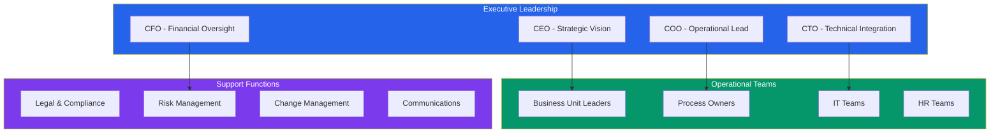

# 👥 01_Stakeholder_Alignment | Building Coalition for Change

> **Building stakeholder coalition and engagement strategy for AI transformation success**

This folder contains stakeholder mapping, engagement strategies, and change management frameworks essential for securing buy-in and driving adoption throughout the AI operating model transformation.

---

## 📌 Phase Overview

The **Stakeholder Alignment phase** focuses on identifying, mapping, and engaging all stakeholders critical to transformation success. This phase builds the coalition necessary to drive change and ensures sustainable adoption of AI-enabled processes.

**Consulting Parallel**: *This mirrors the "Stakeholder Engagement" workstream where consultants build consensus, manage resistance, and create momentum for transformation.*

**Duration**: Weeks 1-4  
**Key Focus**: Coalition building, communication strategy, change readiness

---

## 🎯 Phase Objectives

### **Coalition Building**
- Map stakeholder influence, interest, and impact on transformation success
- Identify champions, supporters, and potential sources of resistance
- Develop targeted engagement strategies for different stakeholder groups

### **Communication Strategy**
- Create clear, compelling messaging for the transformation vision
- Design communication channels and feedback mechanisms
- Establish regular touchpoints and progress updates

### **Change Management Foundation**
- Assess organizational readiness for change
- Design change management approach and governance
- Plan capability building and training requirements

---

## 📁 Folder Contents

| Document | Purpose | Stakeholder Focus | Status |
|----------|---------|------------------|--------|
| **[Stakeholder_Map.md](./Stakeholder_Map.md)** | Comprehensive stakeholder analysis and influence mapping | All stakeholders | ✅ Complete |
| **[RACI_Matrix.md](./RACI_Matrix.md)** | Roles, responsibilities, and decision rights framework | Core team + Leaders | ✅ Complete |
| **[Comms_Plan.md](./Comms_Plan.md)** | Multi-channel communication plan and messaging framework | Leadership + All teams | ✅ Complete |
| **[Engagement_Strategy.md](./Engagement_Strategy.md)** | Detailed stakeholder engagement roadmap and activities | All stakeholders | 🔄 In Progress |
| **[Change_Readiness_Assessment.md](./Change_Readiness_Assessment.md)** | Organizational readiness evaluation and gap analysis | HR + Management | 🔄 In Progress |
| **Stakeholder_Power_Interest_Grid.png** | Visual stakeholder influence and interest mapping | Executive summary | ✅ Complete |

---

## 🗺️ Stakeholder Framework

### **Key Stakeholder Categories**

### **Power-Interest Analysis**

| Quadrant | Stakeholder Type | Engagement Strategy |
|----------|------------------|---------------------|
| **High Power, High Interest** | Executive Sponsors, COO | **Manage Closely** - Regular updates, direct involvement |
| **High Power, Low Interest** | Board Members, Regulators | **Keep Satisfied** - Periodic briefings, formal reports |
| **Low Power, High Interest** | End Users, AI Team | **Keep Informed** - Regular communication, feedback loops |
| **Low Power, Low Interest** | Wider Organization | **Monitor** - Awareness campaigns, town halls |

---

## 📊 Communication Strategy

### **Multi-Channel Approach**

| Stakeholder Group | Key Message | Channel | Frequency | Owner |
|-------------------|-------------|---------|-----------|-------|
| **Executive Leadership** | Strategic rationale, ROI, risk posture | Executive briefings, dashboards | Monthly | Program Director |
| **Management Layer** | Team impact, timeline, support available | Management meetings, workshops | Bi-weekly | Change Manager |
| **End Users** | What's changing, benefits, training | Email updates, training sessions | Weekly | Communications Lead |
| **IT Teams** | Technical requirements, integration | Working sessions, technical briefs | Weekly | Technical Architect |

### **Core Messaging Framework**
1. **Why AI?** - Market pressures and competitive advantages
2. **What's changing?** - Process improvements and role evolution
3. **What's in it for me?** - Individual and team benefits
4. **When is this happening?** - Timeline and milestones
5. **How will I be supported?** - Training and change support

---

## 🎯 Engagement Activities

### **Phase 1: Foundation** *(Weeks 1-2)*
- **Stakeholder Interviews** - One-on-one sessions with key leaders
- **Influence Mapping** - Power-interest analysis and coalition planning
- **Communication Launch** - Initial messaging and awareness campaign

### **Phase 2: Coalition Building** *(Weeks 3-4)*
- **Champion Network** - Identify and engage transformation advocates
- **Resistance Management** - Address concerns and build confidence
- **Feedback Integration** - Incorporate stakeholder input into planning

### **Key Activities by Week**

| Week | Activity | Deliverable | Success Metric |
|------|----------|-------------|----------------|
| **1** | Stakeholder interviews and mapping | Stakeholder influence grid | 100% key stakeholder engagement |
| **2** | RACI development and communication launch | RACI matrix, communication plan | 95% message reach |
| **3** | Champion identification and resistance assessment | Champion network, risk mitigation plan | 80% champion commitment |
| **4** | Coalition validation and readiness assessment | Change readiness report | 75% readiness score |

---

## 🚨 Risk Management

### **Stakeholder-Related Risks**

| Risk | Impact | Probability | Mitigation Strategy |
|------|--------|-------------|---------------------|
| **Executive Sponsor Disengagement** | High | Medium | Weekly updates, visible quick wins, escalation protocol |
| **Middle Management Resistance** | Medium | High | Early involvement, clear value proposition, champion network |
| **End User Anxiety** | Medium | Medium | Transparent communication, comprehensive training plan |
| **Champion Burnout** | Low | Medium | Rotate responsibilities, provide adequate support |
| **Communication Fatigue** | Medium | Low | Varied channels, relevant content, feedback incorporation |

### **Early Warning Indicators**
- Declining meeting attendance (< 80%)
- Negative sentiment in pulse surveys (< 6/10)
- Delayed response to requests (> 48 hours)
- Champion disengagement or resignation

---

## 📈 Success Measurement

### **Engagement Metrics**
- **Participation Rate**: 90%+ attendance at transformation activities
- **Communication Reach**: 95%+ of target audience receiving key messages
- **Response Quality**: Constructive feedback from all stakeholder groups
- **Champion Activation**: Active advocates in every business unit

### **Sentiment Tracking**
- **Baseline Survey**: Initial readiness and enthusiasm assessment
- **Weekly Pulse**: Quick sentiment and concern tracking
- **Monthly Deep Dive**: Detailed feedback on progress and challenges

### **Coalition Strength Indicators**
- **Executive Sponsorship**: Visible support and resource commitment
- **Management Buy-in**: Active participation in planning and communication
- **Champion Network**: Peer influence and local advocacy
- **Resistance Resolution**: Timely identification and mitigation of blockers

---

## ✅ Phase Success Criteria

### **Week 2 Targets**
- [ ] Complete stakeholder mapping with influence assessment
- [ ] RACI matrix approved by steering committee
- [ ] Communication strategy launched with initial messages
- [ ] Champion network identified and engaged

### **Week 4 Completion Criteria**
- [ ] All stakeholders understand transformation vision and their role
- [ ] Clear communication channels established and operational
- [ ] Change resistance identified with mitigation plans in place
- [ ] Coalition of champions actively supporting transformation
- [ ] Organizational readiness assessed and gaps identified

### **Phase Gate Requirements**
- [ ] Executive sponsor sign-off on stakeholder strategy
- [ ] Steering committee approval of communication plan
- [ ] Change readiness score of 75% or higher
- [ ] Zero high-risk stakeholder resistance issues unaddressed

---

## 🔄 Integration with Project Phases

### **Foundation from 00_Overview**
- Project charter provides stakeholder structure
- Governance framework establishes decision rights
- Success criteria inform engagement priorities

### **Input to 02_Current_State**
- Stakeholder priorities guide process analysis focus
- Champion network provides SME access and validation
- Communication channels enable feedback collection

### **Preparation for Future Phases**
- Engaged stakeholders ready for solution co-creation
- Communication infrastructure supports change rollout
- Champion network enables adoption acceleration

---

## 🎨 Tools & Templates

### **Available Resources**
- **Stakeholder Mapping Template** - Excel-based influence assessment
- **Communication Calendar** - Weekly messaging schedule
- **Champion Toolkit** - Resources for transformation advocates
- **Pulse Survey Template** - Regular sentiment tracking
- **Resistance Management Playbook** - Structured approach to concerns

### **Visual Assets**
- **Stakeholder Power-Interest Grid** - Executive summary visual
- **Communication Flow Diagram** - Channel and frequency mapping
- **Champion Network Map** - Organizational influence visualization

---

## 🎯 Critical Success Factors

### **Executive Leadership**
- **Visible Commitment** - Regular, consistent messaging from sponsors
- **Resource Allocation** - Adequate time and budget commitment
- **Decision Authority** - Clear escalation and resolution process

### **Middle Management**
- **Early Engagement** - Involvement in planning and design phases
- **Clear Value Proposition** - Understanding of personal and team benefits
- **Support Structure** - Tools and resources for team leadership

### **Champion Network**
- **Diverse Representation** - Coverage across all business units and levels
- **Empowerment** - Authority to influence and advocate within their areas
- **Connection** - Regular interaction and knowledge sharing opportunities

---

**👥 Building the coalition that drives transformation success**

*Previous: [00_Overview](../00_Overview/) | Next: [02_Current_State](../02_Current_State/)*

