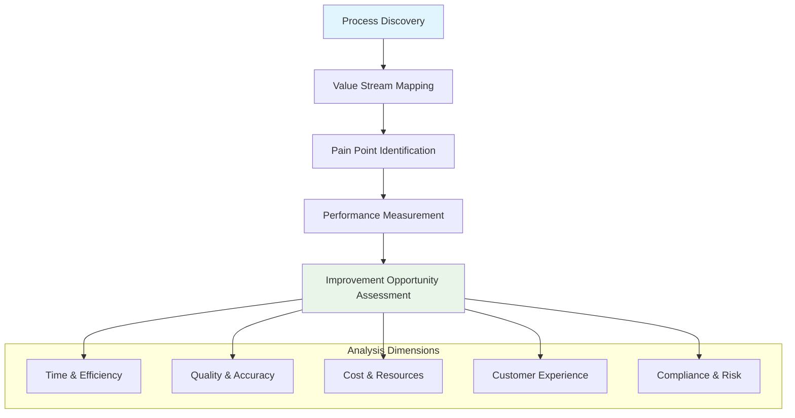

# 📊 02_Current_State | Baseline Assessment & Analysis

> **Comprehensive assessment of current operating model to establish transformation baseline**

This folder contains detailed analysis of the current state across processes, technology, organization, and performance metrics. These assessments establish the baseline for measuring transformation impact and identifying optimization opportunities.

---

## 📌 Phase Overview

The **Current State Assessment** phase provides comprehensive documentation and analysis of existing operations before AI transformation. This phase establishes the factual foundation for all subsequent analysis and design work.

**Consulting Parallel**: *This mirrors the "Diagnostic" phase where consultants conduct detailed current state analysis to understand baseline performance and identify improvement opportunities.*

---

## 🎯 Phase Objectives

### **Baseline Establishment**
- Document current processes, workflows, and operational procedures
- Assess technology landscape, data architecture, and system capabilities
- Evaluate organizational structure, roles, and skill capabilities
- Establish performance metrics and operational benchmarks

### **Gap Identification**
- Identify process inefficiencies, bottlenecks, and pain points
- Assess technology limitations and integration challenges
- Evaluate skill gaps and organizational readiness for change
- Quantify performance gaps against industry benchmarks

### **Opportunity Recognition**
- Highlight areas with highest automation and AI potential
- Identify quick wins and immediate improvement opportunities
- Assess data quality and availability for AI initiatives
- Evaluate change readiness and cultural factors

---

## 📁 Folder Contents

| Document | Purpose | Analysis Focus |
|----------|---------|----------------|
| **[Process_Landscape.md](./Process_Landscape.md)** | End-to-end process mapping and workflow analysis | Operational processes |
| **[Technology_Assessment.md](./Technology_Assessment.md)** | Current technology stack, data architecture, and capabilities | IT infrastructure |
| **[Organizational_Analysis.md](./Organizational_Analysis.md)** | Structure, roles, skills, and cultural assessment | People & organization |
| **[Performance_Baseline.md](./Performance_Baseline.md)** | Current metrics, KPIs, and benchmark analysis | Performance data |
| **[Pain_Points_Analysis.md](./Pain_Points_Analysis.md)** | Identified issues, bottlenecks, and improvement opportunities | Problem areas |
| **[Data_Maturity_Assessment.md](./Data_Maturity_Assessment.md)** | Data quality, governance, and AI readiness evaluation | Data capabilities |
| **Current_State_Process_Map.png** | Visual process flow and system integration diagram | Process visualization |

---

## 🔍 Assessment Framework

### **Process Analysis Methodology**

### **Technology Assessment Framework**
- **Infrastructure Evaluation**: Cloud readiness, scalability, security
- **Application Portfolio**: System inventory, integration points, modernization needs
- **Data Architecture**: Sources, quality, governance, accessibility
- **AI/ML Readiness**: Platforms, tools, computational capabilities

### **Organizational Assessment Framework**
- **Structure Analysis**: Reporting relationships, decision rights, spans of control
- **Capability Assessment**: Skills inventory, competency gaps, training needs
- **Cultural Evaluation**: Change readiness, innovation mindset, collaboration patterns
- **Performance Management**: Goal alignment, measurement systems, incentive structures

---

## 📈 Current State Metrics

### **Process Performance Indicators**
- **Cycle Time**: End-to-end process duration and variability
- **Throughput**: Volume processed per time period
- **Quality Metrics**: Error rates, rework frequency, customer satisfaction
- **Resource Utilization**: FTE allocation, system usage, cost per transaction

### **Technology Performance Indicators**
- **System Availability**: Uptime, reliability, performance metrics
- **Integration Efficiency**: Data flow speed, API response times, error rates
- **User Experience**: System usability, adoption rates, support ticket volume
- **Security & Compliance**: Incident frequency, audit findings, policy adherence

### **Organizational Performance Indicators**
- **Productivity Metrics**: Output per FTE, goal achievement rates
- **Engagement Scores**: Employee satisfaction, retention rates, innovation participation
- **Skill Readiness**: Competency assessments, training completion, certification levels
- **Change Capability**: Previous transformation success, change velocity, adaptation speed

---

## 🎨 Analysis Techniques

### **Process Mapping Methods**
- **Swimlane Diagrams**: Cross-functional process flows with handoff points
- **Value Stream Maps**: End-to-end value creation with waste identification
- **SIPOC Analysis**: Suppliers, Inputs, Process, Outputs, Customers mapping
- **Root Cause Analysis**: Systematic problem identification and causation mapping

### **Data Collection Approaches**
- **Stakeholder Interviews**: Structured discussions with process owners and users
- **Process Observation**: Direct workflow monitoring and time-motion studies
- **System Analysis**: Log file review, performance data extraction, usage analytics
- **Document Review**: Policy analysis, procedure documentation, historical reports

### **Benchmarking Methodology**
- **Internal Benchmarking**: Historical performance trends and departmental comparison
- **Industry Benchmarking**: Sector-specific performance standards and best practices
- **Functional Benchmarking**: Cross-industry process excellence comparison
- **Competitive Analysis**: Market positioning and capability gap assessment

---

## 🚨 Common Current State Challenges

### **Process-Related Issues**
- **Manual Handoffs**: Paper-based or email-driven process transitions
- **Approval Bottlenecks**: Sequential authorization requirements causing delays
- **Data Re-entry**: Multiple system inputs for same information
- **Exception Handling**: Lack of standardized approaches for non-standard cases

### **Technology-Related Issues**
- **Legacy Systems**: Outdated platforms with limited integration capabilities
- **Data Silos**: Isolated systems with poor data sharing and visibility
- **Manual Reporting**: Spreadsheet-based analytics and dashboard creation
- **Security Gaps**: Inconsistent access controls and audit trail limitations

### **Organizational Issues**
- **Role Ambiguity**: Unclear responsibilities and decision rights
- **Skill Gaps**: Limited digital literacy and analytical capabilities
- **Change Resistance**: Historical challenges with transformation initiatives
- **Communication Barriers**: Poor information flow and feedback mechanisms

---

## 📊 Assessment Outputs

### **Process Documentation**
- **Current State Process Maps**: Visual workflow documentation with system touchpoints
- **Pain Point Register**: Prioritized list of inefficiencies and improvement opportunities
- **Performance Baseline**: Quantified metrics for cycle time, quality, and cost
- **Automation Opportunity Matrix**: Process activities ranked by automation potential

### **Technology Documentation**
- **System Architecture Diagram**: Current technology landscape and integration points
- **Data Flow Maps**: Information movement and transformation across systems
- **Capability Gap Analysis**: Technology limitations and modernization requirements
- **AI Readiness Assessment**: Infrastructure and data preparation for AI initiatives

### **Organizational Documentation**
- **Organizational Chart**: Current structure with roles and reporting relationships
- **Skills Matrix**: Competency assessment and development requirements
- **Culture Assessment**: Change readiness and transformation capability evaluation
- **Performance Dashboard**: Current metrics and benchmark comparison

---

## 🎯 Phase Success Criteria

### **Week 1-2 Targets**
- [ ] Process inventory completed with major workflows identified
- [ ] Stakeholder interviews conducted with key process owners
- [ ] Technology landscape documented with system relationships mapped
- [ ] Initial pain points identified and categorized

### **Week 3-4 Targets**
- [ ] Detailed process maps completed for priority workflows
- [ ] Performance baseline established with quantified metrics
- [ ] Organizational assessment completed with skill gap analysis
- [ ] Data maturity evaluation finished with AI readiness scoring

### **Phase Completion Criteria**
- [ ] Comprehensive current state documentation validated by stakeholders
- [ ] Performance baseline established with reliable measurement systems
- [ ] Priority improvement opportunities identified and quantified
- [ ] Next phase (Opportunity Analysis) foundation established

---

## 📋 Quality Assurance

### **Documentation Standards**
- **Process Maps**: Consistent notation, clear decision points, measurable activities
- **Data Analysis**: Validated sources, statistical significance, trend analysis
- **Stakeholder Input**: Multiple perspectives, fact-checking, consensus building
- **Performance Metrics**: Baseline establishment, trend analysis, benchmark comparison

### **Validation Approach**
- **Process Owner Review**: Workflow accuracy validation and feedback incorporation
- **Data Verification**: Multiple source confirmation and statistical validation
- **Leadership Alignment**: Strategic relevance confirmation and priority setting
- **User Experience Validation**: End-user perspective and practical accuracy

---

## 🔄 Integration with Next Phase

### **Opportunity Analysis Preparation**
- **Process Improvement Targets**: Areas with highest potential for AI enhancement
- **Technology Integration Points**: Systems requiring modernization or replacement
- **Organizational Change Requirements**: Skills development and structure modifications
- **Performance Improvement Goals**: Quantified targets for transformation success

### **Baseline for Impact Measurement**
- **Current Performance Metrics**: Foundation for ROI calculation and impact tracking
- **Process Efficiency Standards**: Starting point for improvement measurement
- **Technology Capability Assessment**: Basis for infrastructure investment planning
- **Organizational Readiness Baseline**: Foundation for change management success tracking

---

**📊 Establishing the foundation for transformation success**

*Previous: [01_Stakeholder_Alignment](../01_Stakeholder_Alignment/) | Next: [03_Opportunity_Analysis](../03_Opportunity_Analysis/)*

