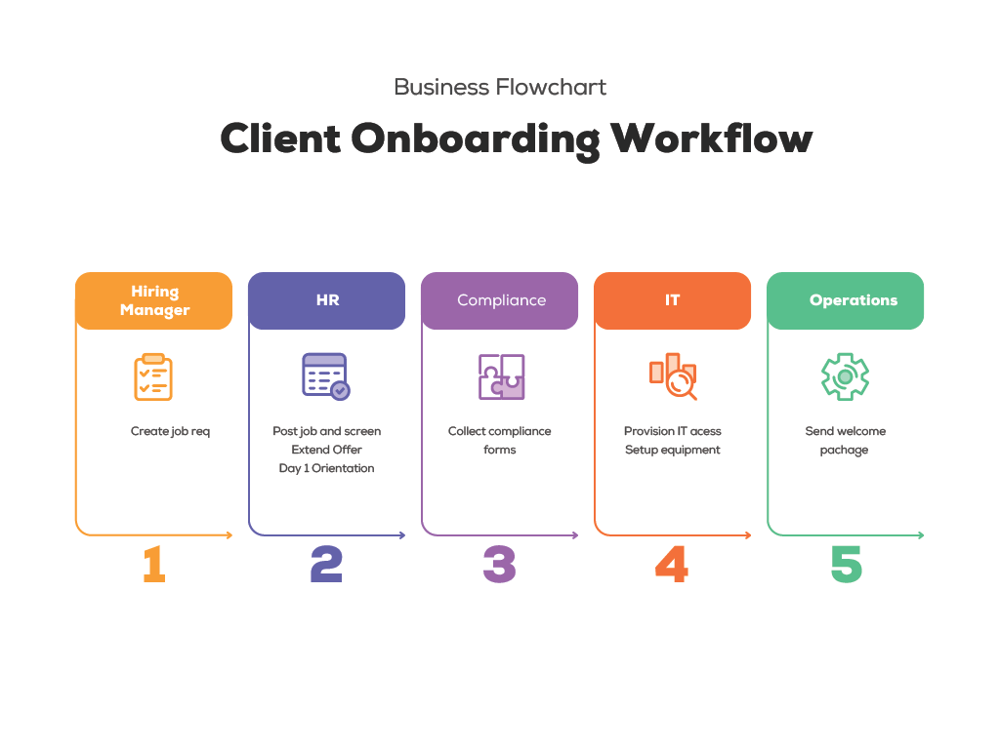

# 🧩 02_Current_State

This folder documents the baseline analysis of the organization's current operating model. It includes written process mapping, visual documentation, and structured outputs to support future-state design and automation targeting.

---

## 🔍 Folder Contents

| File / Template                               | Description                                                              |
|-----------------------------------------------|--------------------------------------------------------------------------|
| `Process_Map.md`                              | Describes major workflows in their current form                          |
| `Current_State_Summary.md`                    | Phase completion checklist and insights                                  |
| `templates/Lifecycle_Workflow.xlsx`           | HR lifecycle workflow with pain points and automation potential          |
| `Client_Onboarding_Workflow.png`              | Visual diagram of onboarding process used for stakeholder alignment      |

---

## 🧩 Client Onboarding Workflow

This visual illustrates the current-state onboarding process across Hiring, HR, Compliance, IT, and Operations. It captures **handoffs, delays, and process silos** that impact Day 1 readiness.

The diagram is used in stakeholder sessions to highlight friction and surface early automation opportunities like auto-provisioning, pre-filled compliance forms, and template-driven hiring requests.

---

## 🧠 Key Insights

- Onboarding and access provisioning are heavily manual and fragmented across teams.
- HR lifecycle activities rely on outdated systems and require redundant approvals.
- IT provisioning delays affect Day 1 productivity for new hires.
- These pain points establish the foundation for targeting high-impact automation and workflow optimization in the next phase.

---

## 🛠️ How to Use

- Use `Process_Map.md` to explore departmental workflows and identify friction points.
- Use `Lifecycle_Workflow.xlsx` to analyze inefficiencies across the employee lifecycle.
- Reference `Client_Onboarding_Workflow.png` as a visual aid for stakeholder discussions and future-state design.
- Use `Current_State_Summary.md` to confirm phase completeness and extract executive-level insights.

---

**Last updated:** May 2025
