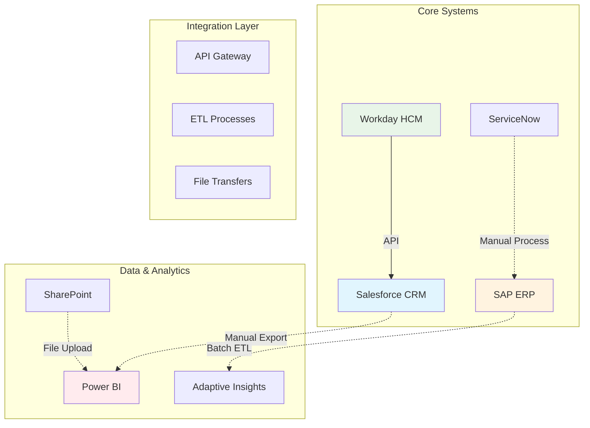

# 🖥️ Technology Assessment – Current State Analysis

**Document Purpose**: Comprehensive technology landscape and capability assessment  
**Phase**: Current State Assessment (Weeks 5-8)  
**Owner**: IT Director & Technical Architect  
**Last Updated**: June 2025

---

## 📌 Assessment Overview

This document provides detailed analysis of the current technology landscape, system capabilities, integration architecture, and AI/automation readiness. The assessment identifies technology gaps, integration challenges, and infrastructure requirements for successful AI transformation.

### **Assessment Methodology**
- **System Inventory**: Complete application and infrastructure catalog
- **Performance Analysis**: System performance metrics and user experience evaluation
- **Integration Assessment**: Data flow analysis and API capability review
- **Security Evaluation**: Compliance, governance, and risk assessment
- **AI Readiness Scoring**: Technology capability for automation and AI implementation

---

## 🏗️ Current Technology Architecture

### **Enterprise Application Portfolio**

| System Category | Application | Version | Vendor | Users | Integration Score | Performance Score |
|----------------|-------------|---------|---------|-------|------------------|------------------|
| **Customer Relationship** | Salesforce CRM | Lightning | Salesforce | 125 | 6/10 | 7.4/10 |
| **Enterprise Resource Planning** | SAP ERP | S/4HANA | SAP | 200 | 4/10 | 6.8/10 |
| **Human Resources** | Workday HCM | 2024.1 | Workday | 450 | 7/10 | 8.1/10 |
| **Financial Planning** | Adaptive Insights | Current | Workday | 35 | 5/10 | 7.2/10 |
| **IT Service Management** | ServiceNow | Tokyo | ServiceNow | 78 | 3/10 | 5.9/10 |
| **Document Management** | SharePoint | 2019 | Microsoft | 350 | 4/10 | 5.8/10 |
| **Business Intelligence** | Power BI | Current | Microsoft | 85 | 2/10 | 5.2/10 |
| **Communication** | Microsoft 365 | Current | Microsoft | 450 | 8/10 | 8.3/10 |

**Overall Technology Score**: 6.1/10 (Target: 8.5/10)

### **Infrastructure Landscape**

| Component | Current State | Capacity Utilization | Performance Rating | Scalability Score |
|-----------|---------------|---------------------|-------------------|------------------|
| **Cloud Platform** | Azure (Hybrid) | 67% | 7.8/10 | 8.5/10 |
| **On-Premise Servers** | Windows Server 2019 | 82% | 6.4/10 | 4.2/10 |
| **Database Systems** | SQL Server 2019, Oracle 12c | 74% | 7.1/10 | 6.8/10 |
| **Network Infrastructure** | Cisco (Refreshed 2022) | 45% | 8.2/10 | 7.9/10 |
| **Security Platform** | Multi-vendor | 68% | 6.9/10 | 5.8/10 |
| **Backup & Recovery** | Veeam + Azure | 73% | 7.6/10 | 8.1/10 |

**Infrastructure Readiness Score**: 7.2/10

---

## 📊 System Performance Analysis

### **Application Performance Metrics**

| Application | Availability | Avg Response Time | Error Rate | User Satisfaction | Performance Trend |
|-------------|--------------|------------------|------------|-------------------|------------------|
| **Salesforce CRM** | 99.2% | 2.1 seconds | 0.8% | 7.4/10 | ↗️ Improving |
| **SAP ERP** | 98.7% | 4.3 seconds | 1.2% | 6.8/10 | ↔️ Stable |
| **Workday HCM** | 99.5% | 1.8 seconds | 0.5% | 8.1/10 | ↗️ Improving |
| **ServiceNow** | 97.8% | 3.7 seconds | 2.1% | 5.9/10 | ↘️ Declining |
| **SharePoint** | 96.4% | 5.2 seconds | 3.4% | 5.8/10 | ↘️ Declining |
| **Power BI** | 94.6% | 8.2 seconds | 4.1% | 5.2/10 | ↘️ Declining |

**Critical Issues**: Power BI and SharePoint performance degrading, impacting reporting and collaboration

### **User Experience Analysis**

| Experience Factor | Current Score | Target Score | Gap Analysis | Impact |
|------------------|---------------|--------------|--------------|--------|
| **System Speed** | 6.1/10 | 8.5/10 | -39% | High productivity impact |
| **Interface Usability** | 6.8/10 | 8.0/10 | -15% | Medium learning curve |
| **Mobile Access** | 5.2/10 | 8.0/10 | -35% | High remote work impact |
| **Integration Experience** | 4.8/10 | 8.5/10 | -44% | High manual effort |
| **Reporting Capability** | 5.1/10 | 8.0/10 | -36% | High decision-making impact |

**Overall User Experience**: 5.6/10 (Critical improvement needed)

---

## 🔗 Integration Architecture Assessment

### **Current Integration Landscape**

### **Integration Capability Matrix**

| System Pair | Integration Type | Data Frequency | Automation Level | Quality Score | Improvement Priority |
|-------------|------------------|----------------|------------------|---------------|---------------------|
| **Salesforce ↔ SAP** | Manual Export/Import | Weekly | 20% | 4/10 | High |
| **Workday ↔ Salesforce** | API Integration | Real-time | 80% | 8/10 | Low |
| **SAP ↔ Power BI** | ETL Pipeline | Daily | 60% | 6/10 | Medium |
| **ServiceNow ↔ SAP** | Manual Process | As-needed | 10% | 3/10 | High |
| **SharePoint ↔ All Systems** | File Sharing | Manual | 15% | 3/10 | High |

**Integration Maturity Score**: 4.8/10 (Target: 8.0/10)

### **Data Flow Analysis**

| Data Type | Source System | Target System | Current Method | Volume/Day | Error Rate | Automation Potential |
|-----------|---------------|---------------|----------------|------------|------------|---------------------|
| **Customer Data** | Salesforce | SAP, Power BI | Manual export | 150 records | 12% | High |
| **Employee Data** | Workday | All systems | API + Manual | 45 records | 5% | Medium |
| **Financial Data** | SAP | Power BI, AI | ETL + Manual | 1,200 records | 8% | High |
| **Service Tickets** | ServiceNow | SAP | Manual entry | 78 tickets | 15% | High |
| **Documents** | SharePoint | All systems | Manual sharing | 200 files | 20% | Medium |

**Data Integration Efficiency**: 38% automated (Target: 85%)

---

## 🔒 Security & Compliance Assessment

### **Security Posture Analysis**

| Security Domain | Current Rating | Compliance Level | Gap Analysis | Risk Level |
|----------------|----------------|------------------|--------------|------------|
| **Identity & Access Management** | 7.2/10 | 92% | MFA implementation gaps | Medium |
| **Data Protection** | 6.8/10 | 85% | Encryption inconsistencies | Medium |
| **Network Security** | 8.1/10 | 95% | Segmentation improvements needed | Low |
| **Application Security** | 6.4/10 | 78% | Legacy system vulnerabilities | High |
| **Compliance Framework** | 7.6/10 | 88% | Audit trail gaps | Medium |
| **Incident Response** | 6.9/10 | 82% | Automation opportunities | Medium |

**Overall Security Score**: 7.1/10 (Target: 8.5/10)

### **Compliance Status**

| Regulation/Standard | Compliance Level | Last Audit | Next Review | Gap Areas |
|-------------------|------------------|------------|-------------|-----------|
| **SOX Compliance** | 92% | March 2025 | September 2025 | Access controls |
| **GDPR** | 88% | January 2025 | July 2025 | Data retention |
| **ISO 27001** | 85% | February 2025 | August 2025 | Risk management |
| **Industry Standards** | 90% | April 2025 | October 2025 | Audit trails |

**Critical Finding**: Application security gaps pose risk for AI implementation

---

## 🤖 AI/Automation Readiness Assessment

### **Technology Capability for AI Implementation**

| Capability Area | Current State | AI Readiness Score | Investment Needed | Timeline |
|----------------|---------------|-------------------|------------------|----------|
| **Cloud Infrastructure** | Azure hybrid | 8.5/10 | $125K | 3 months |
| **Data Platform** | Fragmented | 6.2/10 | $280K | 6 months |
| **API Architecture** | Partial | 5.8/10 | $340K | 8 months |
| **Security Framework** | Baseline | 7.1/10 | $95K | 4 months |
| **Integration Platform** | Manual-heavy | 4.8/10 | $450K | 9 months |
| **Analytics Platform** | Basic BI | 5.1/10 | $220K | 5 months |

**Overall AI Readiness**: 6.3/10 (Target for AI implementation: 8.0/10)

### **AI Platform Requirements**

| AI Use Case | Current Capability | Gap Analysis | Required Investment | Implementation Complexity |
|-------------|-------------------|--------------|-------------------|--------------------------|
| **Process Automation (RPA)** | 3/10 | High | $85K | Low |
| **Document Processing** | 2/10 | Very High | $195K | Medium |
| **Predictive Analytics** | 4/10 | High | $245K | High |
| **Chatbots/Virtual Assistants** | 1/10 | Very High | $125K | Medium |
| **Workflow Automation** | 5/10 | Medium | $165K | Low |

**Priority Investment**: API integration platform for automation foundation

---

## 📈 Technology Performance Trends

### **6-Month Performance Evolution**

| Metric | Jan 2025 | Mar 2025 | May 2025 | Trend | Root Cause |
|--------|----------|----------|----------|-------|------------|
| **System Availability** | 97.8% | 98.1% | 98.3% | ↗️ Improving | Infrastructure upgrades |
| **Response Time** | 4.8s | 4.2s | 4.1s | ↗️ Improving | Performance tuning |
| **User Satisfaction** | 5.9/10 | 6.1/10 | 6.2/10 | ↗️ Improving | Training and support |
| **Integration Success** | 85% | 87% | 89% | ↗️ Improving | Process improvements |
| **Security Incidents** | 12/month | 8/month | 6/month | ↗️ Improving | Security investments |

**Positive Trend**: Technology metrics improving but still below targets

### **Capacity Planning**

| Resource | Current Utilization | 12-Month Projection | Capacity Gap | Investment Timing |
|----------|-------------------|-------------------|--------------|-------------------|
| **Cloud Compute** | 67% | 85% | Medium | 6 months |
| **Database Storage** | 74% | 92% | High | 3 months |
| **Network Bandwidth** | 45% | 62% | Low | 12 months |
| **API Calls** | 58% | 78% | Medium | 6 months |
| **Backup Storage** | 73% | 89% | Medium | 4 months |

**Critical Action**: Database storage expansion needed within 3 months

---

## 🎯 Technology Modernization Priorities

### **High-Impact Modernization Opportunities**

| Priority | Technology Area | Business Impact | Technical Complexity | Investment | ROI Timeline |
|----------|----------------|-----------------|-------------------|------------|--------------|
| **1** | API Integration Platform | High | Medium | $340K | 12 months |
| **2** | Data Platform Modernization | High | High | $280K | 18 months |
| **3** | Power BI Replacement/Upgrade | Medium | Low | $220K | 8 months |
| **4** | SharePoint Migration | Medium | Medium | $165K | 10 months |
| **5** | ServiceNow Optimization | Medium | Low | $95K | 6 months |

### **AI Implementation Roadmap**

**Phase 1: Foundation** *(Months 1-6)*
- API integration platform implementation
- Data quality improvement program
- Security framework enhancement

**Phase 2: Automation** *(Months 7-12)*
- RPA implementation for high-volume processes
- Workflow automation deployment
- Basic chatbot development

**Phase 3: Intelligence** *(Months 13-18)*
- Predictive analytics implementation
- Advanced document processing
- Machine learning model deployment

---

## 🚨 Critical Technology Risks

### **High-Priority Risk Assessment**

| Risk | Probability | Impact | Current Controls | Mitigation Strategy | Owner |
|------|------------|--------|------------------|-------------------|-------|
| **Legacy System Failure** | Medium | High | Basic monitoring | Accelerated modernization | IT Director |
| **Data Security Breach** | Low | Very High | Multi-layered security | Zero-trust implementation | CISO |
| **Integration Failure** | High | Medium | Manual fallbacks | API platform deployment | Integration Lead |
| **Performance Degradation** | Medium | Medium | Monitoring alerts | Capacity expansion | Operations Manager |
| **Compliance Violation** | Low | High | Regular audits | Automated compliance | Compliance Officer |

### **Technology Debt Analysis**

| Debt Category | Estimated Cost | Business Impact | Resolution Timeline | Priority |
|--------------|----------------|-----------------|-------------------|----------|
| **Legacy Application Updates** | $450K | High | 12 months | High |
| **Security Patches/Upgrades** | $125K | Very High | 3 months | Critical |
| **Integration Technical Debt** | $340K | High | 9 months | High |
| **Performance Optimization** | $185K | Medium | 6 months | Medium |
| **Documentation Updates** | $65K | Low | 4 months | Low |

**Total Technology Debt**: $1.17M (Annual budget impact: 23%)

---

## 📊 Technology Investment Analysis

### **Current Technology Spend Analysis**

| Category | Annual Spend | % of Total | Industry Benchmark | Gap |
|----------|--------------|------------|-------------------|-----|
| **Software Licenses** | $2.4M | 45% | 38% | +7% |
| **Infrastructure** | $1.8M | 34% | 35% | -1% |
| **Professional Services** | $0.7M | 13% | 15% | -2% |
| **Training & Development** | $0.2M | 4% | 7% | -3% |
| **Innovation/R&D** | $0.2M | 4% | 5% | -1% |

**Total IT Spend**: $5.3M annually (12% of revenue - within industry norms)

### **ROI Analysis for Modernization**

| Investment Area | Cost | Annual Benefit | Payback Period | 3-Year NPV |
|----------------|------|---------------|----------------|------------|
| **API Platform** | $340K | $285K | 14 months | $520K |
| **Data Platform** | $280K | $195K | 17 months | $285K |
| **Analytics Upgrade** | $220K | $165K | 16 months | $245K |
| **Process Automation** | $185K | $240K | 9 months | $465K |

**Portfolio ROI**: 168% over 3 years

---

## ✅ Technology Assessment Summary

### **Key Findings**
- **Integration gaps** preventing automation and creating manual overhead
- **Performance issues** in reporting and collaboration tools impacting productivity
- **AI readiness score of 6.3/10** requires foundation investments before advanced implementations
- **Strong cloud infrastructure** provides good foundation for modernization
- **Security posture adequate** but needs enhancement for AI implementation

### **Strategic Recommendations**
1. **Prioritize API integration platform** to enable automation and reduce manual processes
2. **Modernize analytics and reporting** to support data-driven decision making
3. **Implement data governance program** to improve data quality for AI initiatives
4. **Enhance security framework** to support AI and automation implementations
5. **Develop AI center of excellence** to guide technology adoption and governance

### **Next Phase Integration**
This assessment provides the technical foundation for:
- **Opportunity Analysis**: Technology feasibility scoring for AI use cases
- **Solution Design**: Architecture requirements and integration planning
- **Implementation Planning**: Resource requirements and timeline estimation
- **Risk Management**: Technology risks and mitigation strategies

---

**🖥️ Technology readiness enables AI transformation success**

*Related: [Performance_Baseline.md](./Performance_Baseline.md) | Next: [03_Opportunity_Analysis](../03_Opportunity_Analysis/)*

