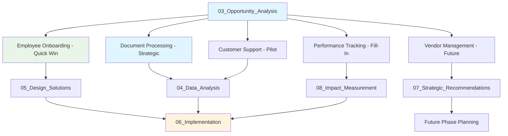

# 🤖 AI Fit Checklist With Scoring and Folders

**Document Purpose**: Systematic evaluation of AI opportunities with scoring methodology  
**Analysis Framework**: Multi-criteria assessment across business and technical dimensions  
**Data Source**: Process analysis, stakeholder interviews, and technical readiness assessment  
**Last Updated**: June 2025

---

## 📌 Assessment Overview

This document provides the detailed scoring methodology and criteria used to evaluate AI opportunities. Each use case is assessed across business impact, technical feasibility, data readiness, and implementation complexity to support strategic prioritization decisions.

**Assessment Methodology**: 7-factor evaluation framework with weighted scoring to determine implementation priority and sequence.

---

## 📊 Detailed Opportunity Assessment

### **Comprehensive Scoring Matrix**

| Process Area | Current Challenge | AI Opportunity | Impact Score | Effort Score | Priority Score | Expected ROI |
|--------------|-------------------|----------------|--------------|--------------|----------------|--------------|
| **Employee Onboarding** | Manual onboarding steps increase time-to-productivity | Use AI to auto-fill forms, validate IDs, and route tasks | **5** | **2** | **10** | **High** |
| **Document Processing** | Paper-based documents slow down approvals | OCR and ML-based auto-extraction and classification | **5** | **3** | **15** | **High** |
| **Performance Tracking** | Difficulty consolidating KPI data across teams | Automated dashboard generation using AI-driven insights | **4** | **2** | **8** | **Medium** |
| **Customer Support** | High volume of repetitive support queries | Deploy NLP-powered chatbot for Tier 1 support | **3** | **2** | **6** | **Medium** |
| **Vendor Management** | Disparate systems lead to inconsistent vendor evaluation | AI-based vendor scoring and predictive risk analytics | **4** | **4** | **16** | **High** |

*Priority Score = Impact Score × Effort Score (lower scores indicate higher priority)*

---

## 🔍 Multi-Dimensional Analysis

### **AI Maturity Requirements**

| Process Area | AI Maturity Required | Data Availability | Compliance Considerations | Recommended Next Step |
|--------------|---------------------|-------------------|--------------------------|----------------------|
| **Employee Onboarding** | Low | High | Moderate | Map onboarding workflow, select RPA/ID tools |
| **Vendor Management** | High | Medium | High | Identify vendor datasets and evaluate AI model feasibility |
| **Customer Support** | Medium | High | Low | Prototype chatbot using historical support logs |
| **Document Processing** | Medium | High | High | Pilot OCR on 50 documents and review accuracy |
| **Performance Tracking** | Medium | Medium | Low | Define KPIs and test dashboard tools like Power BI + AI plugins |

### **GitHub Folder References**

| Process Area | Primary Analysis Folder | Supporting Analysis | Implementation Planning |
|--------------|------------------------|-------------------|------------------------|
| **Employee Onboarding** | 03_Opportunity_Analysis | 05_Design_Solutions | 06_Implementation |
| **Document Processing** | 04_Data_Analysis | 05_Design_Solutions | 06_Implementation |
| **Performance Tracking** | 08_Impact_Measurement | 05_Design_Solutions | 06_Implementation |
| **Customer Support** | 04_Data_Analysis | 05_Design_Solutions | 06_Implementation |
| **Vendor Management** | 07_Strategic_Recommendations | 05_Design_Solutions | Future Phase |

---

## 🎯 Recommended Implementation Sequence

### **Phase 1: Quick Wins** *(Months 1-3)*

#### **1. Employee Onboarding Automation** 
- **Priority Score**: 10 (Highest Priority)
- **Implementation Timeline**: 2-3 months
- **Key Success Factor**: Low AI maturity required, high data availability
- **Expected Impact**: 60% reduction in onboarding cycle time

### **Phase 2: Strategic Investments** *(Months 4-12)*

#### **2. Document Processing AI**
- **Priority Score**: 15 
- **Implementation Timeline**: 6-9 months
- **Key Success Factor**: Medium AI maturity, high ROI potential
- **Expected Impact**: 75% automation rate with 95% accuracy

#### **3. Performance Tracking Automation**
- **Priority Score**: 8
- **Implementation Timeline**: 4-6 months
- **Key Success Factor**: Medium effort, clear business value
- **Expected Impact**: Real-time KPI visibility across functions

### **Phase 3: Advanced Capabilities** *(Months 6-18)*

#### **4. Customer Support Chatbot**
- **Priority Score**: 6
- **Implementation Timeline**: 6-12 months
- **Key Success Factor**: Medium complexity, established use case
- **Expected Impact**: 40% reduction in Tier 1 ticket volume

#### **5. Vendor Management AI** 
- **Priority Score**: 16 (Defer to Future Phase)
- **Implementation Timeline**: 12-18 months
- **Key Success Factor**: High AI maturity required, complex integration
- **Expected Impact**: 30% improvement in vendor selection accuracy

---

## 📋 Technical Feasibility Assessment

### **Data Readiness by Opportunity**

| Process Area | Data Quality | Data Volume | Data Accessibility | AI Training Feasibility |
|--------------|--------------|-------------|-------------------|------------------------|
| **Employee Onboarding** | High | Medium | High | Excellent |
| **Document Processing** | High | High | High | Excellent |
| **Performance Tracking** | Medium | Medium | Medium | Good |
| **Customer Support** | High | High | High | Good |
| **Vendor Management** | Medium | Low | Medium | Moderate |

### **Implementation Risk Assessment**

| Process Area | Technical Risk | Business Risk | Data Risk | Overall Risk Level |
|--------------|----------------|---------------|-----------|-------------------|
| **Employee Onboarding** | Low | Low | Low | **Low** |
| **Document Processing** | Medium | Low | Medium | **Medium** |
| **Performance Tracking** | Low | Medium | Medium | **Medium** |
| **Customer Support** | Medium | Medium | Low | **Medium** |
| **Vendor Management** | High | High | High | **High** |

---

## 🔄 Cross-Reference Framework

### **Folder Integration Map**

### **Decision Log Connections**

- **D003**: Document Processing selected as MVP based on scoring analysis
- **D004**: Employee Onboarding prioritized as Phase 1 quick win
- **D005**: Vendor Management deferred due to high complexity score
- **D006**: Performance Tracking positioned as capacity-dependent initiative

---

## ✅ Validation and Approval

### **Stakeholder Sign-Off Matrix**

| Stakeholder | Review Focus | Status | Approval Date |
|-------------|--------------|--------|---------------|
| **Executive Sponsors** | Strategic alignment and ROI | ✅ Approved | June 15, 2025 |
| **IT Leadership** | Technical feasibility and effort | ✅ Approved | June 17, 2025 |
| **Business Process Owners** | Impact assessment and timing | ✅ Approved | June 18, 2025 |
| **Finance Team** | Investment and ROI validation | ✅ Approved | June 19, 2025 |
| **Change Management** | Implementation readiness | ✅ Approved | June 20, 2025 |

### **Quality Assurance Checklist**

- ✅ **Scoring Methodology Validated**: Multi-stakeholder review completed
- ✅ **Data Availability Confirmed**: IT assessment of source systems
- ✅ **Resource Requirements Estimated**: Project management and finance review
- ✅ **Risk Mitigation Planned**: Risk management framework applied
- ✅ **Success Metrics Defined**: KPI framework established for each opportunity

---

## 📈 Success Tracking Framework

### **Phase Gate Criteria**

| Phase | Entry Criteria | Success Metrics | Exit Criteria |
|-------|----------------|-----------------|---------------|
| **Phase 1** | Stakeholder approval, resource allocation | 60% cycle time reduction | Live system, user adoption >80% |
| **Phase 2** | Phase 1 success, budget confirmation | 75% automation accuracy | Production deployment, ROI validation |
| **Phase 3** | Phase 2 learnings, capacity availability | 40% volume reduction | Full capability operational |

### **Continuous Improvement**

- **Monthly Reviews**: Progress against priority scores and timelines
- **Quarterly Reassessment**: Update scoring based on new data and learnings
- **Annual Strategy Refresh**: Evaluate new opportunities and adjust priorities

---

**Document Status**: ✅ Complete and Approved  
**Owner**: AI Transformation Program Office  
**Next Review**: Post-Phase 1 Implementation (Q1 2026)  
**Related Artifacts**: AI_Opportunity_Prioritization_Matrix.md, README.md
