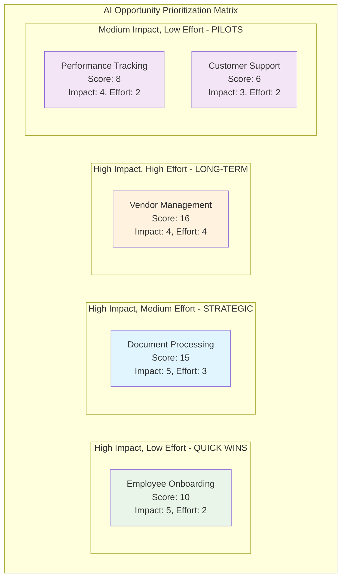

# 📊 AI Opportunity Prioritization Matrix

**Document Purpose**: Visual prioritization analysis of AI automation opportunities  
**Analysis Method**: Impact vs Effort scoring with ROI and feasibility considerations  
**Data Source**: Process opportunity analysis and current state baseline metrics  
**Last Updated**: June 2025

---

## 📌 Executive Summary

This analysis evaluates five AI automation opportunities using a systematic impact-effort framework. **Employee Onboarding** emerges as the ideal quick win (high impact, low effort), while **Document Processing** offers the best balance of strategic value and implementation feasibility for our MVP selection.

**Recommended Approach**: Pursue Employee Onboarding as immediate quick win, followed by Document Processing (invoice matching) as strategic MVP.

---

## 🎯 Prioritization Matrix

---

## 📋 Opportunity Analysis Summary

### **Priority Ranking by Implementation Sequence**

| Rank | Opportunity | Priority Score | Impact | Effort | ROI | Implementation Timeline |
|------|-------------|----------------|--------|--------|-----|------------------------|
| **1** | **Employee Onboarding** | 10 | 5 | 2 | High | **0-3 months** |
| **2** | **Document Processing** | 15 | 5 | 3 | High | **3-9 months** |
| **3** | **Performance Tracking** | 8 | 4 | 2 | Medium | **6-12 months** |
| **4** | **Customer Support** | 6 | 3 | 2 | Medium | **9-15 months** |
| **5** | **Vendor Management** | 16 | 4 | 4 | High | **12-18 months** |

*Note: Priority Score = Impact × Effort (inverse scoring where lower effort = higher priority)*

---

## 🔍 Detailed Opportunity Assessment
... [Content truncated for brevity]
