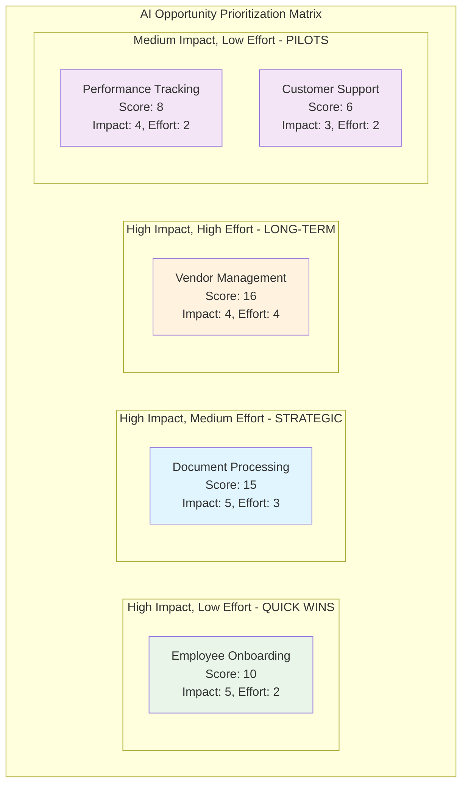

# 🎯 AI Opportunity Prioritization Matrix

**Impact vs Implementation Effort Analysis**

---

## 📊 Prioritization Framework

<table>
<tr>
<td colspan="2" align="center"><strong>HIGH BUSINESS IMPACT</strong></td>
</tr>
<tr>
<td width="50%" bgcolor="#d4edda" align="center">
<h3>🚀 QUICK WINS</h3>

<strong>High Impact | Low Effort</strong>

<em>Immediate Action</em>

 
<ul align="left">
<li><strong>Employee Onboarding Automation</strong> 
<small>Streamline new hire processes with AI workflows</small></li>
</ul>
</td>
<td width="50%" bgcolor="#d1ecf1" align="center">
<h3>🎯 STRATEGIC BETS</h3>

<strong>High Impact | High Effort</strong>

<em>Major Projects</em>

 
<ul align="left">
<li><strong>Predictive Attrition Analytics</strong> 
<small>AI-powered employee retention modeling</small></li>
<li><strong>Document Processing AI</strong> 
<small>Intelligent document classification and extraction</small></li>
</ul>
</td>
</tr>
<tr>
<td bgcolor="#fff3cd" align="center">
<h3>📋 FILL-INS</h3>

<strong>Low Impact | Low Effort</strong>

<em>Easy Wins</em>

 
<ul align="left">
<li><strong>Email Auto-Response System</strong> 
<small>Basic automated email handling</small></li>
<li><strong>Basic Chatbot FAQ</strong> 
<small>Simple question-answer automation</small></li>
</ul>
</td>
<td bgcolor="#f8d7da" align="center">
<h3>❌ QUESTION MARKS</h3>

<strong>Low Impact | High Effort</strong>

<em>Avoid/Defer</em>

 
<ul align="left">
<li><strong>Advanced NLP Analysis</strong> 
<small>Complex language processing initiatives</small></li>
</ul>
</td>
</tr>
<tr>
<td colspan="2" align="center"><strong>LOW BUSINESS IMPACT</strong></td>
</tr>
</table>

<strong>← LOW IMPLEMENTATION EFFORT ────────────── HIGH IMPLEMENTATION EFFORT →</strong>

---

## 🎯 Strategic Recommendations

### **Phase 1: Quick Wins** *(Months 1-3)*
- **🚀 Employee Onboarding Automation**
  - **ROI**: 6-month payback period
  - **Effort**: 2-3 weeks implementation
  - **Impact**: 60% time reduction in onboarding process

### **Phase 2: Strategic Bets** *(Months 4-12)*
- **🎯 Predictive Attrition Analytics**
  - **ROI**: $2.1M annual savings potential
  - **Effort**: 3-6 months development
  - **Impact**: 20% reduction in voluntary turnover

- **🎯 Document Processing AI**
  - **ROI**: 40% faster document processing
  - **Effort**: 4-8 months implementation
  - **Impact**: Compliance improvement + cost savings

### **Phase 3: Fill-Ins** *(As capacity allows)*
- **📋 Email Auto-Response & Basic Chatbot**
  - **ROI**: Moderate efficiency gains
  - **Effort**: 1-2 weeks each
  - **Impact**: Improved response times

### **Defer Indefinitely**
- **❌ Advanced NLP Analysis**
  - **Rationale**: High complexity, unclear business value
  - **Alternative**: Re-evaluate in 12-18 months

---

## 📈 Implementation Priority

| Priority | Opportunity | Business Impact | Implementation Effort | Timeline |
|----------|-------------|-----------------|----------------------|----------|
| **1** | Employee Onboarding Automation | High | Low | Q1 |
| **2** | Predictive Attrition Analytics | High | High | Q2-Q3 |
| **3** | Document Processing AI | High | High | Q2-Q4 |
| **4** | Email Auto-Response | Low | Low | Q3 |
| **5** | Basic Chatbot FAQ | Low | Low | Q4 |
| **-** | Advanced NLP Analysis | Low | High | Deferred |

---

## 🎨 Matrix Legend

- 🟢 **Quick Wins**: High impact, low effort → Implement immediately
- 🔵 **Strategic Bets**: High impact, high effort → Plan as major initiatives  
- 🟡 **Fill-Ins**: Low impact, low effort → Implement when capacity allows
- 🔴 **Question Marks**: Low impact, high effort → Avoid or defer

---

**💡 Strategic Insight**: Focus 80% of initial resources on Quick Wins and Strategic Bets to maximize transformation value and build momentum for broader AI adoption.# 📊 AI Opportunity Prioritization Matrix

**Document Purpose**: Visual prioritization analysis of AI automation opportunities  
**Analysis Method**: Impact vs Effort scoring with ROI and feasibility considerations  
**Data Source**: Process opportunity analysis and current state baseline metrics  
**Last Updated**: June 2025

---

## 📌 Executive Summary

This analysis evaluates five AI automation opportunities using a systematic impact-effort framework. **Employee Onboarding** emerges as the ideal quick win (high impact, low effort), while **Document Processing** offers the best balance of strategic value and implementation feasibility for our MVP selection.

**Recommended Approach**: Pursue Employee Onboarding as immediate quick win, followed by Document Processing (invoice matching) as strategic MVP.

---

## 🎯 Prioritization Matrix

---

## 📋 Opportunity Analysis Summary

### **Priority Ranking by Implementation Sequence**

| Rank | Opportunity | Priority Score | Impact | Effort | ROI | Implementation Timeline |
|------|-------------|----------------|--------|--------|-----|------------------------|
| **1** | **Employee Onboarding** | 10 | 5 | 2 | High | **0-3 months** |
| **2** | **Document Processing** | 15 | 5 | 3 | High | **3-9 months** |
| **3** | **Performance Tracking** | 8 | 4 | 2 | Medium | **6-12 months** |
| **4** | **Customer Support** | 6 | 3 | 2 | Medium | **9-15 months** |
| **5** | **Vendor Management** | 16 | 4 | 4 | High | **12-18 months** |

*Note: Priority Score = Impact × Effort (inverse scoring where lower effort = higher priority)*

---

## 🔍 Detailed Opportunity Assessment
... [Content truncated for brevity]
