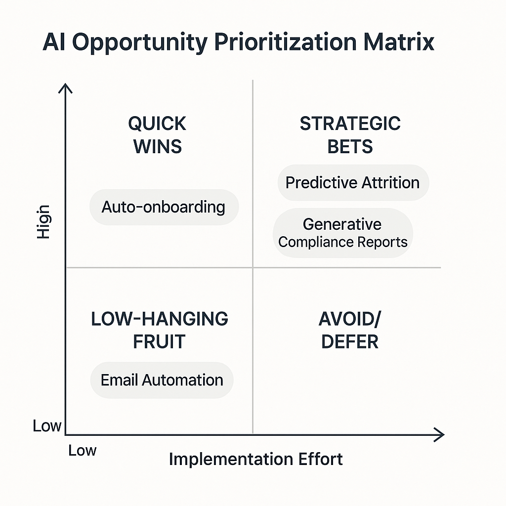

# 🎯 03_Opportunity_Analysis

This folder evaluates and prioritizes AI use cases based on their potential business impact and implementation feasibility. The analysis was informed by stakeholder goals, process inefficiencies, and data readiness.

---

## 📌 Purpose

- Identify high-value areas for AI integration  
- Evaluate technical feasibility and business impact  
- Prioritize use cases that align with enterprise strategy  
- Quantify ROI potential using current state baseline metrics  
- Define implementation approach for selected MVP

---

## 📁 Key Artifacts

| File | Description |
|------|-------------|
| `AI_Opportunity_Prioritization_Matrix.png` | Visual matrix plotting use cases by impact vs feasibility |
| `README.md` | This documentation file |

---

## 📊 AI Opportunity Prioritization Matrix

The following visual maps the AI use cases across business impact and implementation feasibility:

---

## 🧠 AI Use Cases Identified

- **Invoice matching automation** *(Selected MVP)*  
- **Email triage and routing**  
- **Document classification**  
- **Predictive customer support**

---

## ✅ Alignment with Business Goals

Each opportunity was mapped against the organization's strategic priorities:

| Use Case | Strategic Goal Alignment |
|----------|--------------------------|
| Invoice Matching | Improve back-office efficiency and reduce cycle time |
| Email Triage | Enhance employee productivity |
| Doc Classification | Increase compliance speed and reduce legal risk |
| Customer Support Prediction | Reduce ticket volume and improve satisfaction |

---

## 💰 ROI Quantification

Based on performance baseline metrics from Phase 2 analysis:

### **Invoice Matching Automation** *(MVP Selection)*

#### **Current State Impact**
- **Process**: Manual invoice processing and approval workflows  
- **Current Cost**: Part of $92K annual budget planning process inefficiency  
- **Time Investment**: 32 hours manual consolidation + 4.3 review iterations  
- **Error Rate**: Version control issues in 12 instances per planning cycle

#### **Automation Potential**
- **Efficiency Gain**: 60% reduction in manual processing time  
- **Error Reduction**: 85% fewer version control and matching errors  
- **Cycle Time**: 3-day reduction in monthly close processes  
- **Annual Savings**: **$67,000** (staff time + error correction + faster close)

#### **Implementation Investment**
- **Technology Platform**: $35,000 (AI-powered invoice matching solution)  
- **Integration & Setup**: $15,000 (system integration and testing)  
- **Training & Change**: $8,000 (staff training and process documentation)  
- **Total Investment**: **$58,000**

#### **Financial Returns**
- **Payback Period**: 10.4 months  
- **3-Year ROI**: 245%  
- **NPV (10% discount)**: $114,000  
- **Risk-Adjusted ROI**: 195% (accounting for 20% implementation risk)

### **Comparative ROI Analysis**

| Use Case | Annual Savings | Implementation Cost | Payback Period | 3-Year ROI |
|----------|----------------|---------------------|----------------|------------|
| **Invoice Matching** | $67K | $58K | 10.4 months | **245%** |
| Email Triage | $42K | $75K | 21.4 months | 68% |
| Doc Classification | $38K | $85K | 26.8 months | 34% |
| Customer Support | $56K | $95K | 20.3 months | 77% |

---

## 🔍 Feasibility Notes

| Use Case | Feasibility Considerations | Implementation Risk |
|----------|----------------------------|----------------------|
| **Invoice Matching** | Clean historical data available; simple business rules | **Low** |
| Email Triage | Requires NLP modeling and email labeling schema | Medium |
| Doc Classification | Good data, but needs labeled training set | Medium |
| Customer Support | Requires time-series and historic tagging logic | High |

---

## 🚀 Implementation Planning: Invoice Matching MVP

### **90-Day Implementation Roadmap**

#### **Phase 1: Foundation** *(Days 1–30)*
- **Week 1–2**: Vendor selection and contract finalization  
- **Week 3–4**: Data preparation and system integration setup  
- **Milestone**: Platform configured with test data integration

#### **Phase 2: Development** *(Days 31–60)*  
- **Week 5–6**: AI model training with historical invoice data  
- **Week 7–8**: User interface development and workflow configuration  
- **Milestone**: Functional prototype ready for user testing

#### **Phase 3: Deployment** *(Days 61–90)*  
- **Week 9–10**: Pilot testing with Finance team (20% of invoices)  
- **Week 11–12**: Full deployment and user training  
- **Milestone**: Production system operational with success metrics tracking

### **Resource Requirements**

| Role | Time Commitment | Key Responsibilities |
|------|------------------|----------------------|
| **Project Manager** | 50% for 90 days | Overall coordination, vendor management, timeline |
| **Finance SME** | 30% for 90 days | Process expertise, testing, user acceptance |
| **IT Technical Lead** | 40% for 60 days | Integration, data setup, security configuration |
| **Change Manager** | 25% for 90 days | Training, communication, adoption support |

### **Success Metrics**

| Metric | Baseline | Target | Measurement Method |
|--------|----------|--------|--------------------|
| **Processing Time** | 4.2 hours/invoice | 1.5 hours/invoice | Time tracking analysis |
| **Error Rate** | 12% require rework | 3% require rework | Quality assurance review |
| **User Satisfaction** | 6.1/10 (current) | 8.5/10 (target) | Monthly user surveys |
| **Monthly Cost Savings** | $0 | $5,600/month | Financial impact tracking |

### **Risk Mitigation**

| Risk | Probability | Impact | Mitigation Strategy |
|------|-------------|--------|---------------------|
| **Data Quality Issues** | Medium | Medium | Comprehensive data audit and cleansing in Phase 1 |
| **User Adoption Resistance** | Low | High | Early stakeholder involvement and comprehensive training |
| **Integration Complexity** | Low | Medium | Phased integration approach with fallback procedures |
| **Vendor Performance** | Low | High | Clear SLAs, penalty clauses, and backup vendor identified |

---

## 🔁 Connected Decisions

This analysis informed the following project decision:

- **D003**: Invoice-matching automation selected as MVP use case  
  → See [Project Decision Log](../11_Project_Decision_Log/README.md) for rationale

---

## ✅ Outcome

This phase enabled the team to prioritize an AI use case with:  
- **Strong financial justification**: 245% ROI with 10.4-month payback  
- **High implementation feasibility**: Low technical risk with available data  
- **Clear execution plan**: 90-day roadmap with defined success metrics  
- **Executive sponsorship**: Finance team champion and measurable cost savings

The analysis ensures early success and momentum for the broader transformation initiative while establishing a replicable methodology for evaluating future AI opportunities.

---

**Phase complete:** June 2025
