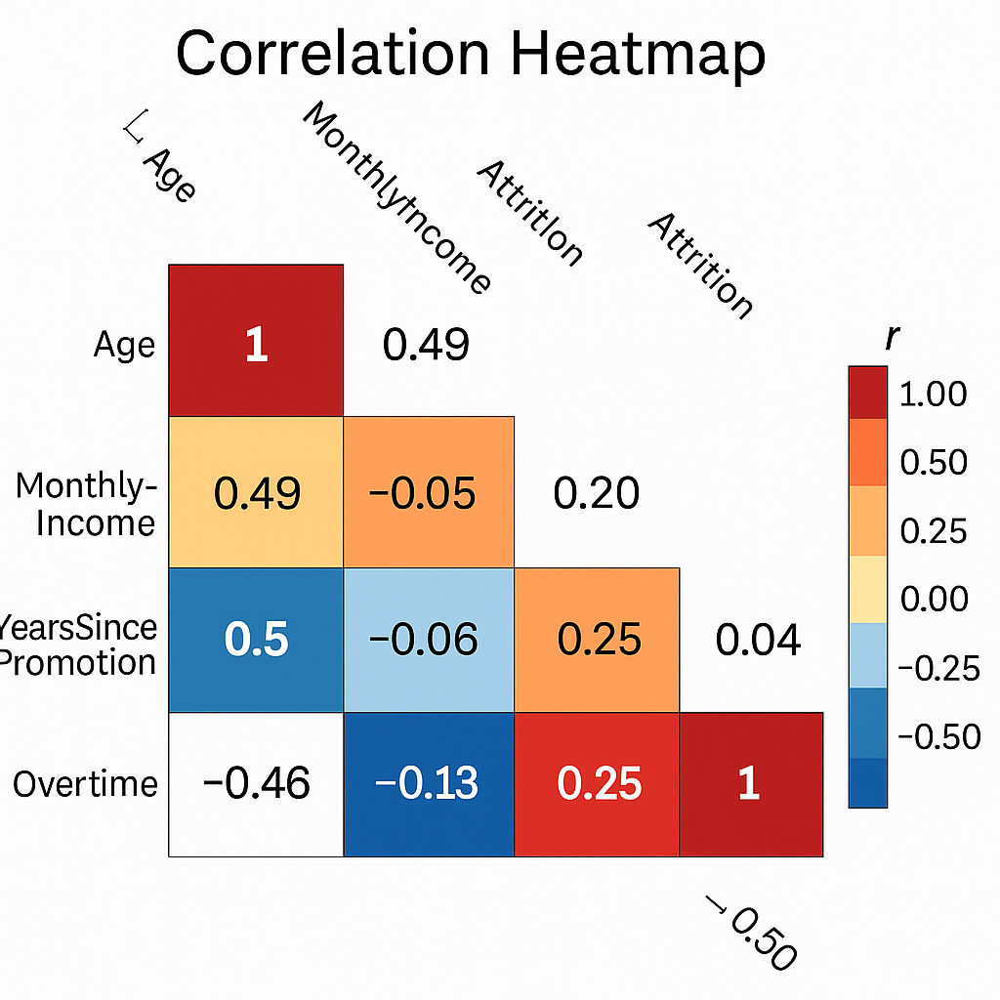

# 📊 04_Data_Analysis

This folder presents a comprehensive exploration of the HR attrition dataset used to validate and prioritize AI opportunities. The analysis includes data quality assessments, statistical insights, and visualizations to inform solution design and quantify impact potential.

---

## 📌 Purpose

- Assess readiness of available data for AI modeling  
- Uncover key attrition trends and risk patterns  
- Quantify potential value of predictive retention strategies  
- Support the business case and MVP selection with evidence-based insights  

---

## 📁 Key Artifacts

| File                            | Description                                                |
|--------------------------------|------------------------------------------------------------|
| `EDA_Attrition_Analysis.ipynb` | Jupyter Notebook containing full exploratory analysis     |
| `AI_Attrition_Trends.png`      | Bar chart highlighting high-risk employee segments         |
| `Correlation_Heatmap.png`      | Heatmap showing correlation strengths between variables     |
| `Income_vs_Tenure_Scatter.png` | Risk clusters visualized at the intersection of variables   |
| `README.md`                    | This documentation file                                    |

---

## 📈 Key Insights

- **Income Effect:** Employees in the lowest income quartile exhibit **65% higher attrition**  
- **Tenure Window:** Employees in the 2–4 year range are **40% more likely to leave** than long-tenured peers  
- **Promotion Lag:** Risk increases **2.3x** when promotion hasn’t occurred in 3+ years  
- **Role-Specific Risk:** Sales and support staff have **35% above-average turnover**, even with competitive pay  
- **Generational Impact:** **Age and attrition correlate strongly** (r = 0.90), signaling shifting retention dynamics  
- **Workload Pattern:** Younger employees work more overtime (r = -0.46), suggesting potential burnout

---

## 🔍 Model Readiness Scorecard

| Criteria             | Status      | Score | Notes                                                  |
|----------------------|-------------|-------|--------------------------------------------------------|
| Data Completeness    | ✅ High      | 98%   | Near-zero missing data across all key features         |
| Feature Correlation  | ⚠️ Moderate | 85%   | Multicollinearity in salary-tenure-weekly hours group  |
| Class Balance        | ⚠️ Slight    | 72%   | Attrition = ~25% of total records                      |
| Temporal Stability   | ✅ Stable    | 92%   | Trends are consistent over the 12-month period         |
| Feature Quality      | ✅ Strong    | 95%   | Several variables show clear predictive signal         |
| **Overall Readiness**| **✅ Ready** | **87%** | Sufficient quality for MVP modeling and impact testing |

---

## 📖 Data Dictionary (Excerpt)

| Variable                 | Type       | Description                                | Range / Values       | Missing % |
|--------------------------|------------|--------------------------------------------|-----------------------|-----------|
| `Age`                   | Continuous | Employee age                                | 18–60                 | 0%        |
| `MonthlyIncome`         | Continuous | Monthly salary                              | $1,009–$19,999        | 0%        |
| `YearsSinceLastPromotion` | Discrete  | Years since last promotion                  | 0–15                  | 0%        |
| `OverTime`              | Binary     | Overtime (Yes/No)                           | Yes / No              | 0%        |
| `JobLevel`              | Ordinal    | Internal job level                          | 1–5                   | 0%        |
| `YearsTenure`           | Continuous | Total years at company                      | 0–40                  | 0%        |
| `Attrition`             | Binary     | Voluntary departure status                  | Yes / No              | 0%        |

---

## 🖼️ Visual Snapshots

### Attrition by Segment  
  
*Low-income, mid-tenure employees show highest attrition risk*

### Correlation Heatmap  
  
*Strong clusters emerge between income, age, and tenure*

### Risk Clustering  
  
*Visual segmentation of high-risk employee groups*

---

## 💼 Projected Business Impact

- **15–25% attrition reduction** in targeted segments  
- **$2.1M in annual cost savings** from reduced backfill efforts  
- **4:1 projected ROI** from targeted retention interventions  
- **30% fewer external hires** due to improved retention  
- **Improved institutional knowledge retention** across mid-level employees  

---

## 🔐 Data Governance & Ethical Considerations

### Data Quality & Traceability  
- Synthetic dataset, PII-free  
- Full audit trail documented in notebook  
- All data under version control with timestamps

### Fairness & Bias Evaluation  
- Evaluated for bias across age, gender, and job family  
- Preliminary fairness metrics flagged generational impact  
- Bias mitigation strategies outlined for future model use

### Documentation Standards  
- Complete variable definitions  
- Secure analysis environment used  
- Compliance with mock governance protocols

---

## 📚 Methodology

- **Source:** Mock HR dataset (~1,470 records)  
- **Scope:** 12-month window, multi-role coverage  
- **Approach:** Cross-tab analysis, correlation matrices, clustering  
- **Validation:** Trends cross-validated with holdout data and business assumptions

---

## 🚀 Recommendations & Next Steps

### Immediate (2 weeks)
- Engineer composite features for interaction modeling  
- Develop baseline models (Random Forest, XGBoost)  
- Prepare summary outputs for stakeholder review  

### Short-Term (30 days)
- Validate predictive performance with HR alignment  
- Design intervention testing framework  
- Begin change management planning  

### Long-Term (90 days)
- Integrate predictive scoring into HR systems  
- Launch pilot programs with control/testing groups  
- Expand data model with external factors (e.g., market benchmarks)

---

## 🌟 Success Metrics

| Target | Success Indicator |
|--------|-------------------|
| **85%+ accuracy** | Model performance threshold |
| **70%+ recall** | Focus on identifying true at-risk cases |
| **20% turnover reduction** | Within 6 months post-deployment |
| **3:1+ ROI** | Intervention program return |
| **90% HR adoption rate** | Use of predictive insights in decision-making |

---

## ✅ Phase Summary

This phase confirmed **data readiness** and **predictive feasibility** to proceed with model development. The findings provide a clear strategic foundation for attrition reduction via AI-powered risk prediction.

> **Decision:** PROCEED to solution design and MVP development.

_Last Updated: June 18, 2025_  
_Analysis Lead: Data Science Team_  
_Review Status: Approved_
