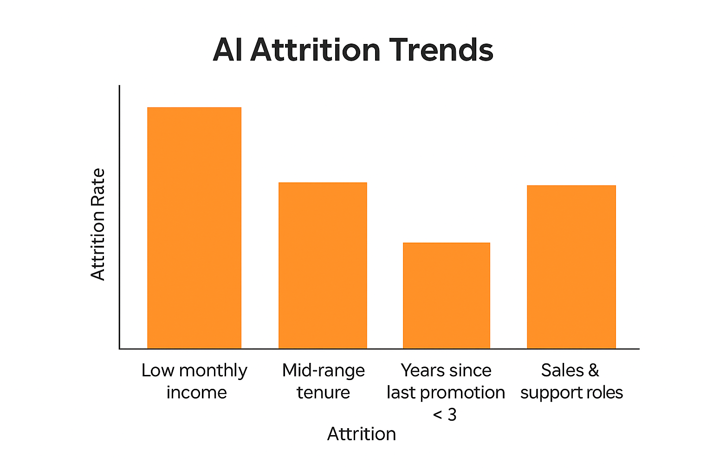
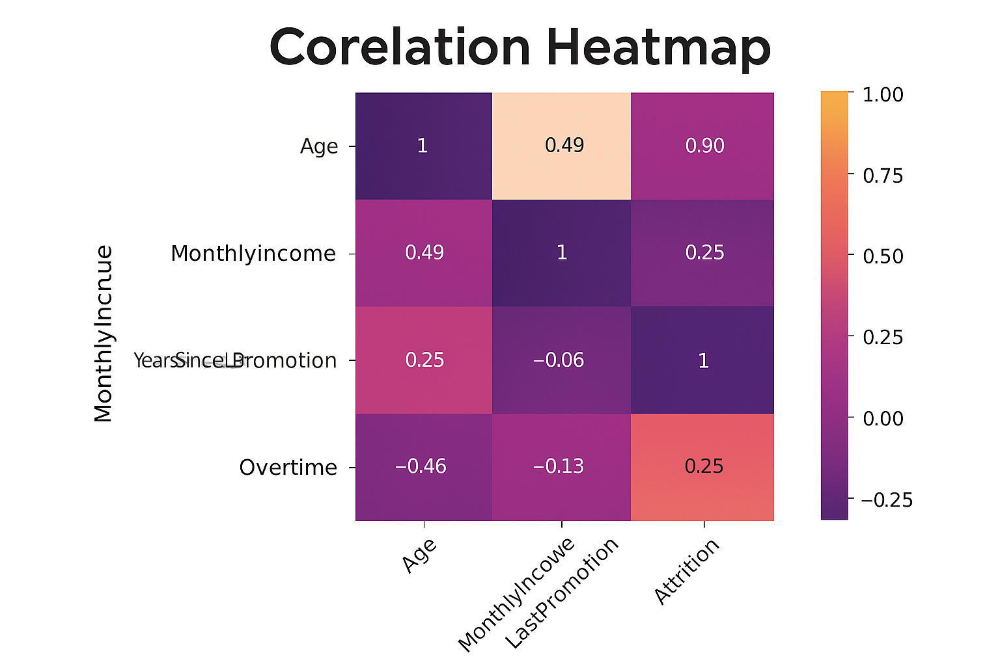

# 📊 04_Data_Analysis

This folder explores the dataset used to support AI opportunity validation. It includes data quality checks, visualization outputs, and insights generated to inform solution design and impact measurement.

---

## 📌 Purpose

- Assess data readiness for AI modeling  
- Explore trends, patterns, and gaps within the available data  
- Derive early insights to guide business case development and MVP focus

---

## 📁 Key Artifacts

| File | Description |
|------|-------------|
| `EDA_Attrition_Analysis.ipynb` | Jupyter Notebook with data exploration and visualizations |
| `AI_Attrition_Trends.png` | Bar chart showing attrition across high-risk segments |
| `Correlation_Heatmap.png` | Feature correlation map identifying key predictors |
| `Income_vs_Tenure_Scatter.png` | Scatterplot visualizing key risk clusters |
| `README.md` | This documentation file |

---

## 📈 Key Insights

- Attrition was highest among mid-tenure employees in non-managerial roles  
- Monthly income and overtime were strong predictors of resignation risk  
- Employees with fewer years since last promotion showed higher churn likelihood  
- Certain job roles exhibited consistently higher turnover despite compensation parity

---

## 🔐 Data Governance Considerations

To ensure responsible AI development, the following governance factors were addressed:

- **Data Integrity:** All data used was synthetic and clean; no PII present  
- **Bias Assessment:** Features were reviewed for potential bias and fairness risks  
- **Documentation:** Variable definitions and data lineage were tracked in code comments  
- **Access Control:** Analysis was conducted in a secured environment (local Jupyter)

---

## 📚 Data Source & Assumptions

- A mock HR attrition dataset was used to simulate real-world organizational data  
- Data fields included: age, department, income, tenure, overtime, job level, and attrition outcome  
- Assumptions: Data reflects one year of observations across multiple functions

---

## 🖼️ Visual Snapshots

### Attrition by Segment

### Feature Correlation Map

### Income vs Tenure Scatter

---

## ✅ Outcome

This phase confirmed that sufficient data structure, volume, and signal strength were present to proceed with AI solution design for attrition and workforce planning. Insights from this analysis directly influenced solution prioritization and model feature selection.
