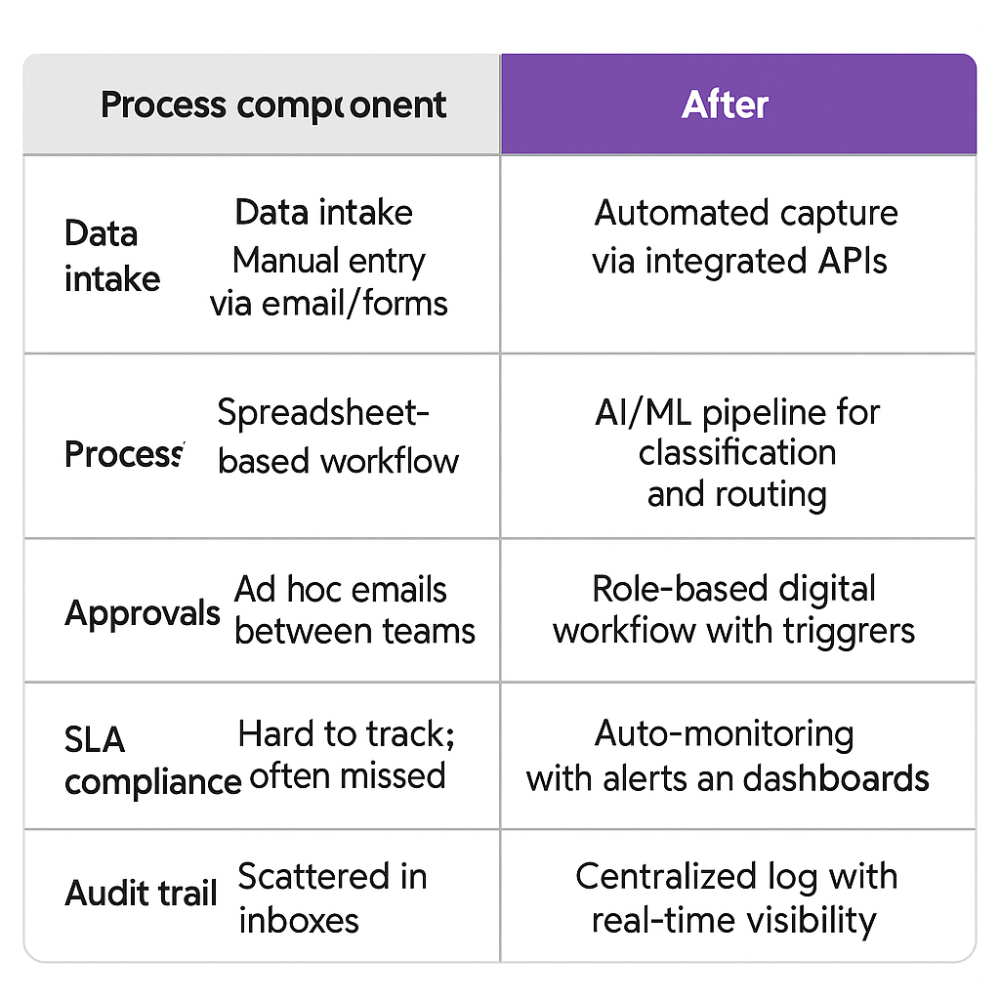
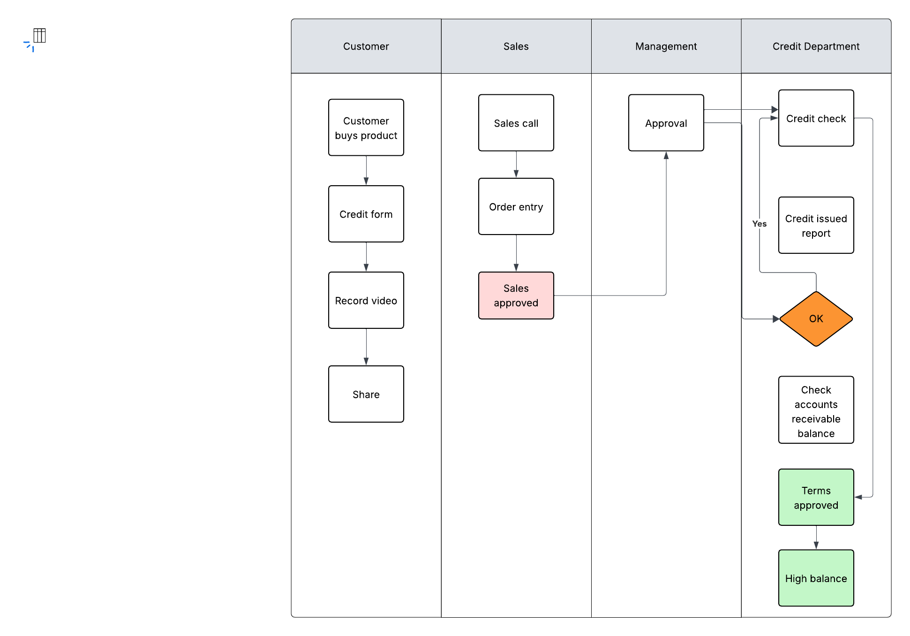
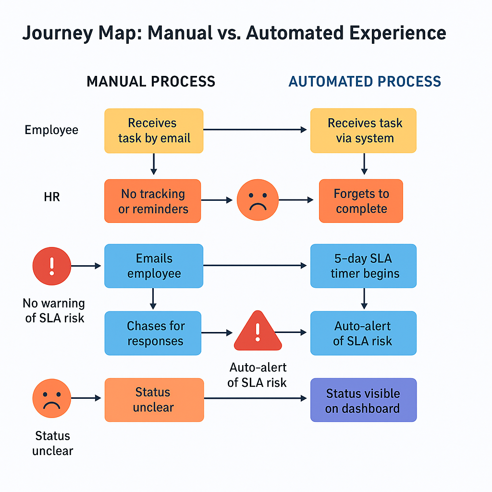

# 🛠️ 05_Design_Solutions

This folder contains solution design artifacts supporting the proposed AI-enabled operating model transformation. These visual frameworks translate the vision into tangible workflows, decision logic, and experience enhancements — all tailored to accelerate execution and drive measurable business outcomes.

---

## 📂 Table of Contents
- [🔍 Executive Summary](#-executive-summary)
- [📁 Visual Artifact Overview](#-visual-artifact-overview)
- [🔄 Automation Trigger Flow](#-automation-trigger-flow)
- [🧾 Before and After Comparison](#-before-and-after-comparison)
- [🏊 Swimlane Diagram: Credit Approval](#-swimlane-diagram-credit-approval)
- [👣 User Journey Map](#-user-journey-map)
- [📌 Supporting Files](#-supporting-files)
- [✏️ Solution Sketches](#️-solution-sketches)

---

## 🔍 Executive Summary

The following designs reflect the "future state" vision across key HR and credit workflows. These solutions combine automation, accountability, and service-level enforcement into visual blueprints for transformation. Each artifact is intended for stakeholder alignment and solution validation during the design and implementation phases.

---

## 📁 Visual Artifact Overview

| Artifact | Description | Preview |
|---------|-------------|---------|
| **Automation Trigger Flow** | AI escalates onboarding tasks after 5 days of inactivity |  |
| **Before/After Comparison** | Shows manual vs. automated onboarding escalation |  |
| **Swimlane Diagram** | Visualizes cross-functional credit approval workflow |  |
| **User Journey Map** | Experience impact of manual vs. AI-enhanced onboarding |  |

---

## 🔄 Automation Trigger Flow

This diagram models an AI notification logic for HR onboarding SLAs. Tasks that remain incomplete beyond 5 days automatically trigger alerts to the responsible HR contact.

**Highlights:**
- Improves visibility into delayed workflows
- Drives accountability through auto-escalation
- Ensures SLA compliance without manual chasing

---

## 🧾 Before and After Comparison

This visual contrasts the manual onboarding escalation process with its AI-enhanced alternative.

**Key Differences:**
- Manual version lacks structure or ownership
- AI introduces proactive tracking and alert triggers
- Simplifies governance with automated routing

---

## 🏊 Swimlane Diagram: Credit Approval

This swimlane outlines the step-by-step flow for onboarding credit approvals, showing how responsibility is distributed across roles.

**Departments Included:**
- Customer
- Sales
- Management
- Credit Department

**Key Benefits:**
- Clarifies decision-making boundaries
- Identifies handoff inefficiencies
- Aligns with automation points in SLA workflow

---

## 👣 User Journey Map

This journey map captures the employee experience during onboarding under two conditions: manual and AI-automated.

**Impact:**
- Automation reduces onboarding friction
- Enables timely resolution through triggers
- Reinforces SLA commitments with transparency

---

## 📌 Supporting Files

| File | Description |
|------|-------------|
| `Framework_Decision_Matrix.xlsx` | Logic behind which solutions were prioritized |
| `Slide_Deck_Design_Solutions.pptx` | Presentation-ready summary for leadership |
| `Workflow Logic for AI Escalation.png` | Additional diagram supporting trigger logic |
| `Solution_Sketches.md` | Placeholder for future design iterations |

---

## ✏️ Solution Sketches

Explore future-state concepts and raw ideation notes for continuous improvement:

👉 [Solution_Sketches.md](./Solution_Sketches.md)

> 💡 This folder serves as a visual anchor for design discussions, solution alignment, and stakeholder buy-in.
