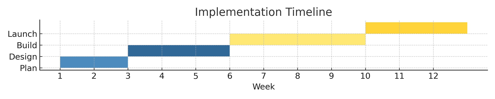
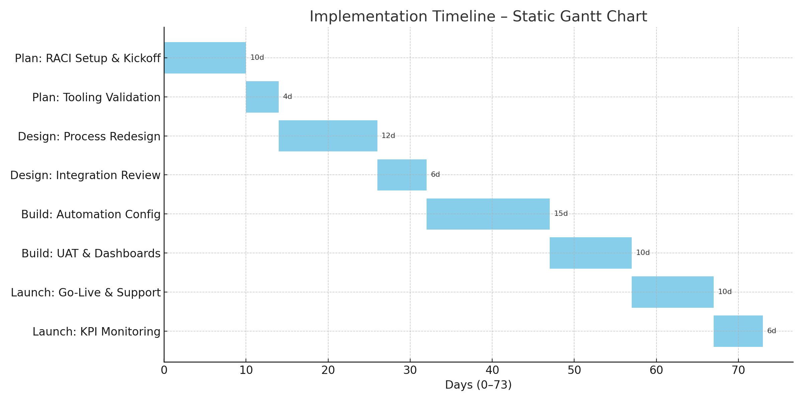
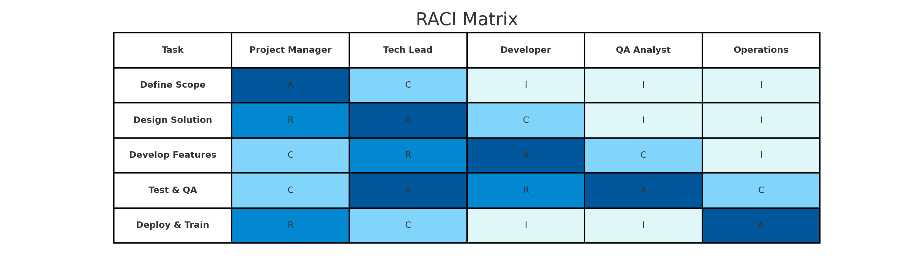
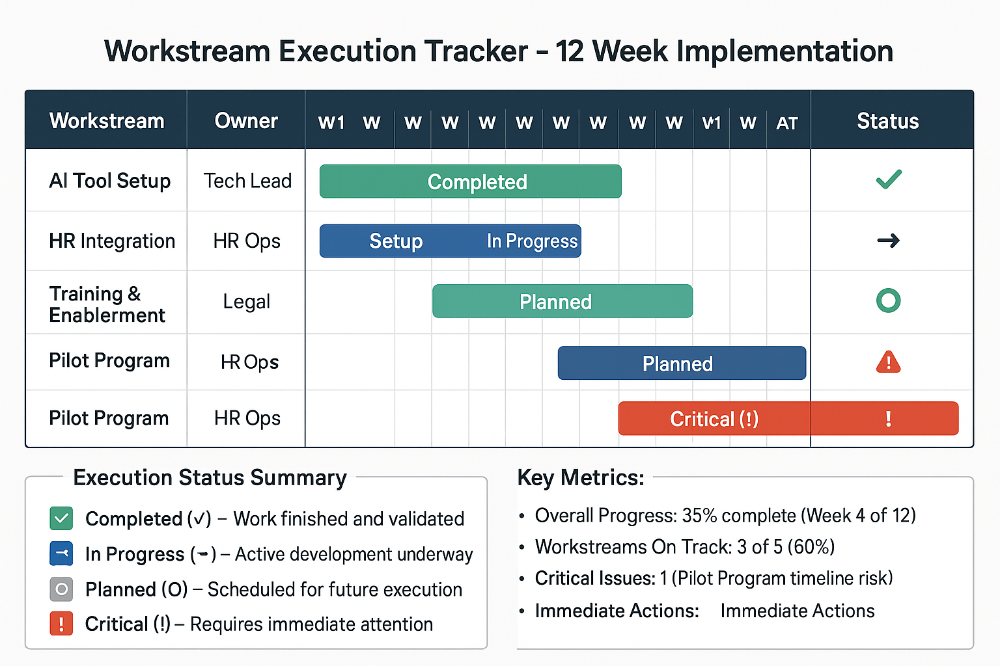

# 🚀 06_Implementation

This folder outlines the implementation roadmap for deploying the proposed AI-enabled operating model transformation. It provides a phased timeline, defined ownership roles, risk planning, and coordinated workstreams to ensure execution readiness across all functional areas.

---

## 📅 Implementation Timeline

A 12-week phased timeline highlights the four core stages of implementation: **Plan**, **Design**, **Build**, and **Launch**.

### 🖼️ Static Timeline Preview

For platforms that don’t support interactive rendering, here’s a static Gantt-style version of the implementation timeline:

> 📌 For the interactive version, view [`Implementation_Timeline_Mermaid.md`](./Implementation_Timeline_Mermaid.md) in a Mermaid.js-compatible viewer (e.g., VS Code, Obsidian, or Mermaid Live Editor).

---

## 👥 RACI Matrix

This matrix defines role clarity for all key contributors using the RACI (Responsible, Accountable, Consulted, Informed) model — ensuring governance and cross-functional accountability.

---

## 🔄 Workstream Execution Tracker

This tracker visualizes implementation progress by mapping out key workstreams, owners, timelines, and current status.

---

## 📌 Core Implementation Deliverables

| File | Description |
|------|-------------|
| [`Implementation_Roadmap.md`](./Implementation_Roadmap.md) | Phase-by-phase breakdown of implementation milestones |
| [`Delivery_Risks_and_Mitigations.md`](./Delivery_Risks_and_Mitigations.md) | Working risk log with active mitigation plans |
| [`Governance_Cadence.md`](./Governance_Cadence.md) | Weekly/monthly execution rhythm for delivery governance |
| [`Implementation_Timeline_Mermaid.md`](./Implementation_Timeline_Mermaid.md) | Interactive timeline for Mermaid-compatible viewers |

---

## 🧠 Key Execution Principles

- 🧭 **Phased Planning**: Clear stages reduce risk and allow faster iteration  
- 👥 **Role Clarity**: RACI ensures decisions are made and acted on swiftly  
- 🚦 **Tracking and Governance**: Dashboards and cadence drive alignment  
- 🛡️ **Proactive Risk Management**: Risks are named, owned, and mitigated in real-time  

> 💡 This folder is designed to guide program managers, transformation leads, and executive sponsors through structured implementation. Files are presentation-ready and reusable across enterprise delivery contexts.
