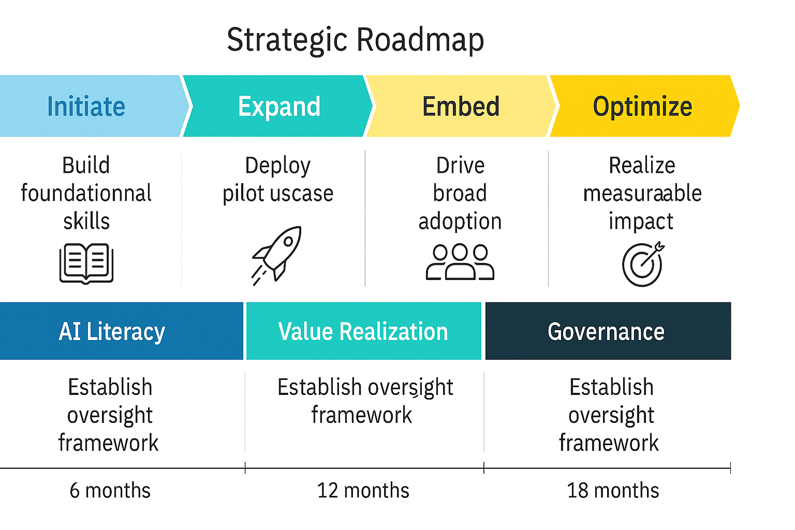

# 🎯 07_Strategic_Recommendations

This folder synthesizes strategic insights from the AI-enabled operating model transformation. It bridges operational execution with long-term business value by outlining priorities, governance, and outcome-based planning.

All deliverables are designed to support executive decision-making, stakeholder alignment, and scalable AI adoption across the enterprise.

---

## 🗺️ Strategic Roadmap

The roadmap below illustrates the four-phase strategy for embedding AI into enterprise operations — from pilot testing to optimized value realization.

> 📌 This roadmap provides the north star view for sequencing business capabilities, change efforts, and AI maturity.

---

## 📁 Folder Contents

| File | Description |
|------|-------------|
| [`Executive_Summary.md`](./Executive_Summary.md) | Strategic narrative and high-level transformation benefits |
| [`AI_Strategy_Framework.md`](./AI_Strategy_Framework.md) | Pillars for enterprise AI integration and long-term scale |
| [`Organizational_Impact_Assessment.md`](./Organizational_Impact_Assessment.md) | Analysis of people, structure, and cultural implications |
| [`Governance_and_Risk_Management.md`](./Governance_and_Risk_Management.md) | Responsible AI practices and risk mitigation structures |
| [`Value_Realization_Plan.md`](./Value_Realization_Plan.md) | Business KPIs and mechanisms for measuring success |

---

## 🧠 Strategic Design Principles

- **Business-Led, Tech-Enabled**: AI is deployed to serve measurable business goals, not as standalone tech experiments.
- **Scalable Governance**: All models and automations are governed through reusable, auditable, and ethical structures.
- **Value Reinforcement**: Change management, training, and feedback loops ensure that gains are sustained beyond launch.
- **Transparency & Trust**: Frameworks include human oversight, model explainability, and compliant data usage.

> 💡 This folder converts operational artifacts into boardroom-ready strategy — making the case for AI as a catalyst for organizational advantage.
