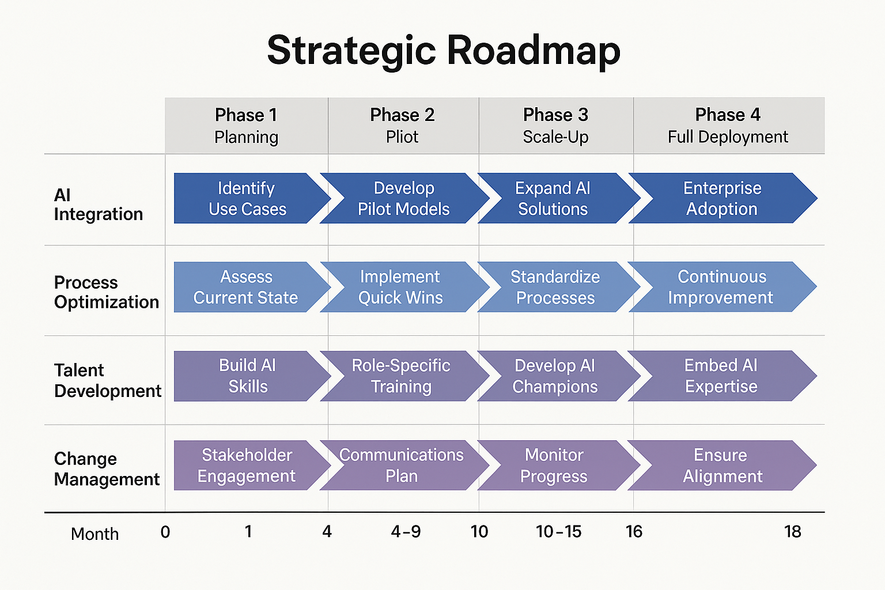

# 🧩 07_Strategic_Recommendations

This folder synthesizes the strategic vision, design frameworks, and transformation roadmap for an AI-enabled operating model. It consolidates insights from stakeholder alignment, maturity diagnostics, governance planning, and change management — culminating in a business-aligned, phased recommendation set.

---

## 🎯 Objective

Deliver strategic recommendations that:

- Address pain points uncovered during current-state and data analysis  
- Leverage high-impact AI automation and augmentation opportunities  
- Align with leadership priorities, cultural readiness, and technical capacity  
- Drive measurable, scalable, and sustainable business value  

---

## 🔍 Strategic Themes

1. **AI Integration** – Embed intelligent automation and decision support  
2. **Process Optimization** – Redesign workflows for speed and scale  
3. **Talent Development** – Upskill teams and promote citizen developers  
4. **Change Management** – Orchestrate adoption through training and feedback  
5. **Governance at Scale** – Enable responsible, traceable, scalable AI usage

---

## 🧠 Executive Summary

This transformation is projected to:
- 🚀 Improve delivery time by 28%  
- 💰 Reduce manual effort by 40%  
- 🛡️ Strengthen compliance and risk posture  
- 📣 Enable cultural readiness for AI adoption  

Executive Overview: [`Executive_Summary.md`](./Executive_Summary.md)

---

## 🗺️ Strategic Roadmap

Phased 18-month plan to implement AI across workflows, systems, and teams.

| Phase         | Description |
|---------------|-------------|
| **Planning**  | Define use cases, KPIs, and readiness checks |
| **Pilot**     | Launch 2–3 targeted AI interventions |
| **Scale-Up**  | Expand AI delivery and repeatable solutions |
| **Deployment**| Normalize AI, embed KPIs, transition ownership |

---

## 📈 AI Maturity Model

Evaluates organizational readiness across six dimensions and five levels — from Ad Hoc to Optimized.

Read the full model: [`AI_Maturity_Model.md`](./AI_Maturity_Model.md)

---

## 🏛️ AI Center of Excellence (CoE)

Establish a centralized capability to scale AI responsibly across business units.

Includes:
- Governance + Risk Management  
- Talent enablement and reusable tools  
- Innovation and delivery support

Framework details: [`AI_Center_of_Excellence_Framework.md`](./AI_Center_of_Excellence_Framework.md)

---

## 🔄 Change Management Strategy

A phased change playbook supporting stakeholder engagement, training, and resistance management.

Highlights:
- Role-based communication by audience  
- Adoption and sentiment metrics  
- Embedded into roadmap phases

Full strategy: [`Change_Management_Strategy.md`](./Change_Management_Strategy.md)

---

## 🛡️ Governance & Risk Management

Guiding principles and controls to scale AI safely:

| Risk Category      | Mitigation Strategy |
|--------------------|---------------------|
| Data Privacy       | Masking, encryption, access control |
| Bias & Fairness    | Diverse training sets, audit cycles |
| Model Drift        | Monitoring + retraining gates |
| AI Misuse          | Role-based access, use logging |

Policy overview: [`Governance_and_Risk_Management.md`](./Governance_and_Risk_Management.md)

---

## 🏢 Organizational Impact

Highlights role realignment and cultural transformation:

- Rise of AI Translators, Prompt Designers, and Model Auditors  
- Teams restructured around data and AI workflows  
- Cultural shift to proactive, insight-driven service delivery  

Impact summary: [`Organizational_Impact_Assessment.md`](./Organizational_Impact_Assessment.md)

---

## 🧾 Final Strategic Recommendations

| Focus Area         | Recommendation |
|--------------------|----------------|
| Use Case Targeting | Focus on high-impact, low-effort processes |
| Governance         | Launch AI Governance Council |
| Talent Strategy    | Enable hybrid business/tech roles |
| Change Management  | Implement feedback and comms loops |
| Value Realization  | Link success to tracked KPIs |

---

## 📥 Supporting Materials

- [📄 Executive Summary](./Executive_Summary.md)  
- [📈 AI Maturity Model](./AI_Maturity_Model.md)  
- [🏛️ AI CoE Framework](./AI_Center_of_Excellence_Framework.md)  
- [🔄 Change Strategy](./Change_Management_Strategy.md)  
- [🛡️ Governance Strategy](./Governance_and_Risk_Management.md)  
- [🏢 Org Impact Assessment](./Organizational_Impact_Assessment.md)  
- [📊 Strategic Recommendations Deck (PDF)](./Strategic_Recommendations_Briefing_Deck.pdf)  
- [📈 Value Realization Plan](./Value_Realization_Plan.md)

---

## ✅ Next Step

Proceed to [`08_Impact_Measurement`](../08_Impact_Measurement) to define AI success metrics, build value dashboards, and validate ROI.
