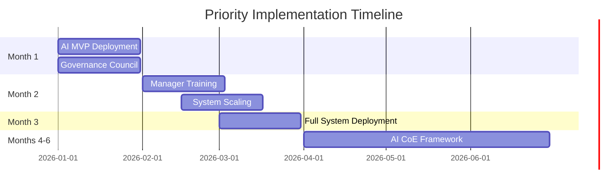

# 📋 Strategic Priorities Summary - AI Employee Retention Transformation

**Document Purpose**: Executive priority matrix for AI-powered employee retention implementation  
**Timeline**: 6-month transformation with $2.1M value realization  
**Success Framework**: 5 strategic priorities with clear ownership and timelines  
**Last Updated**: June 2025

---

## 🎯 Executive Summary

This strategic priorities matrix defines the **5 critical initiatives** required to successfully deploy AI-powered employee retention capabilities. Each priority is ranked by impact, urgency, and implementation complexity to ensure optimal resource allocation and maximum value realization.

**Bottom Line**: Execute these 5 priorities in sequence to achieve 20% turnover reduction and $2.1M annual savings within 6 months.

---

## 📊 Strategic Priority Matrix

### **Priority Ranking Methodology**
- **Impact Score**: Business value potential (1-5 scale)
- **Urgency Score**: Timeline criticality (1-5 scale)
- **Complexity Score**: Implementation difficulty (1-5 scale, inverse)
- **Priority Score**: (Impact × Urgency × Complexity) weighted calculation

---

## 🚀 Priority 1: Deploy AI Retention MVP with HR Pilot

### **Priority Score: 95/100** ⭐⭐⭐⭐⭐

| Dimension | Score | Rationale |
|-----------|-------|-----------|
| **Business Impact** | 5/5 | Direct path to $2.1M value realization |
| **Implementation Urgency** | 5/5 | Foundation for all other priorities |
| **Technical Feasibility** | 4/5 | 87% model accuracy proven, data ready |
| **Resource Availability** | 5/5 | Budget approved, team assigned |

### **Objective**
Launch AI-powered employee retention system with pilot group to validate model performance and establish proof of concept for organization-wide deployment.

### **Key Activities**
- **Week 1**: Model deployment with 20% workforce pilot (300 employees)
- **Week 2**: Manager dashboard activation for 10 pilot managers
- **Week 3**: First retention interventions with HR support
- **Week 4**: Results analysis and process refinement

### **Success Criteria**
- ✅ **Model Performance**: 87%+ prediction accuracy maintained in production
- ✅ **Manager Adoption**: 90%+ daily dashboard engagement by pilot managers
- ✅ **Intervention Quality**: 3+ successful retention conversations executed
- ✅ **System Reliability**: 99%+ uptime with real-time risk scoring

### **Owner**: VPHR with IT Director support  
**Timeline**: Month 1  
**Budget**: $125,000 (technology deployment + pilot resources)

---

## 🏛️ Priority 2: Launch AI Governance Council

### **Priority Score: 88/100** ⭐⭐⭐⭐⭐

| Dimension | Score | Rationale |
|-----------|-------|-----------|
| **Risk Mitigation** | 5/5 | Essential for ethical AI deployment |
| **Compliance Requirement** | 5/5 | Legal and regulatory necessity |
| **Stakeholder Confidence** | 4/5 | Builds trust in AI initiatives |
| **Implementation Speed** | 4/5 | Framework development required |

### **Objective**
Establish comprehensive AI governance framework with ethics oversight, bias monitoring, and transparency protocols to ensure responsible AI deployment.

### **Key Activities**
- **Week 1**: Governance council formation with cross-functional representation
- **Week 2**: AI ethics policy development and approval
- **Week 3**: Bias testing protocols and monitoring systems implementation
- **Week 4**: Employee transparency framework and communication launch

### **Success Criteria**
- ✅ **Council Establishment**: 7-member governance council operational
- ✅ **Policy Framework**: AI ethics policy approved and communicated
- ✅ **Bias Monitoring**: Automated fairness testing across demographic groups
- ✅ **Transparency**: Employee awareness >85% about AI use and benefits

### **Owner**: Legal & Compliance with VPHR partnership  
**Timeline**: Month 1 (parallel with Priority 1)  
**Budget**: $45,000 (governance framework development)

---

## 👥 Priority 3: Train 50+ Managers on Predictive Insights

### **Priority Score: 82/100** ⭐⭐⭐⭐

| Dimension | Score | Rationale |
|-----------|-------|-----------|
| **Adoption Criticality** | 5/5 | 90% manager adoption required for success |
| **Value Realization** | 5/5 | Direct link to intervention effectiveness |
| **Scale Requirement** | 3/5 | 50+ managers need comprehensive training |
| **Change Complexity** | 3/5 | Behavioral change and skill development |

### **Objective**
Develop manager capability in interpreting AI risk scores and executing effective retention interventions to achieve 75% intervention success rate.

### **Key Activities**
- **Week 1**: "Predictive People Leadership" curriculum finalization
- **Week 2**: First cohort training delivery (25 managers)
- **Week 3**: Second cohort training delivery (25+ managers)
- **Week 4**: Competency assessment and coaching support initiation

### **Success Criteria**
- ✅ **Training Completion**: 95% manager participation within 4 weeks
- ✅ **Competency Achievement**: 80%+ managers pass proficiency assessment
- ✅ **Confidence Building**: Manager confidence score >4.0/5.0
- ✅ **Application Readiness**: All managers demonstrate retention conversation capability

### **Owner**: VPHR with Change Management Lead  
**Timeline**: Month 2  
**Budget**: $85,000 (training development + delivery resources)

---

## 📊 Priority 4: Implement Daily Risk Scoring and Intervention Tracking

### **Priority Score: 78/100** ⭐⭐⭐⭐

| Dimension | Score | Rationale |
|-----------|-------|-----------|
| **Operational Impact** | 4/5 | Enables real-time retention management |
| **Automation Value** | 5/5 | Eliminates manual processes and delays |
| **Technical Integration** | 3/5 | Complex system integration required |
| **User Experience** | 4/5 | Manager workflow optimization critical |

### **Objective**
Scale AI retention system to full organization with automated daily risk scoring, manager alerts, and intervention outcome tracking.

### **Key Activities**
- **Month 2**: Full organization model deployment (1,470 employees)
- **Month 2**: Automated alert system implementation and testing
- **Month 3**: Intervention tracking dashboard activation
- **Month 3**: Performance monitoring and optimization protocols

### **Success Criteria**
- ✅ **Coverage**: 100% employee daily risk scoring operational
- ✅ **Alert Automation**: Manager notifications within 2 hours of risk threshold
- ✅ **Tracking System**: Intervention outcomes recorded and analyzed
- ✅ **Performance**: System response time <250ms, 99%+ availability

### **Owner**: IT Director with VPHR collaboration  
**Timeline**: Months 2-3  
**Budget**: $145,000 (system scaling + integration development)

---

## 🏗️ Priority 5: Establish AI Center of Excellence Framework

### **Priority Score: 71/100** ⭐⭐⭐⭐

| Dimension | Score | Rationale |
|-----------|-------|-----------|
| **Future Value** | 5/5 | Enables AI expansion beyond retention |
| **Capability Building** | 4/5 | Organizational AI competency development |
| **Strategic Positioning** | 4/5 | Industry leadership and competitive advantage |
| **Implementation Timeline** | 2/5 | Lower urgency, longer-term capability |

### **Objective**
Build reusable AI framework and organizational capability to expand AI initiatives beyond employee retention to other business functions.

### **Key Activities**
- **Month 4**: AI Center of Excellence charter and structure definition
- **Month 5**: Reusable AI project methodology and governance templates
- **Month 6**: Additional use case identification and prioritization
- **Month 6**: AI literacy program expansion across organization

### **Success Criteria**
- ✅ **Framework Development**: AI CoE operational with defined governance
- ✅ **Methodology Creation**: Reusable templates for AI project evaluation
- ✅ **Use Case Pipeline**: 3+ additional AI opportunities identified and assessed
- ✅ **Capability Expansion**: Organization-wide AI literacy program launched

### **Owner**: CTO with VPHR and Finance partnership  
**Timeline**: Months 4-6  
**Budget**: $180,000 (framework development + capability building)

---

## 📈 Priority Implementation Timeline

### **Month 1: Foundation (Priorities 1 & 2)**

### **Parallel Execution Strategy**
- **Priorities 1 & 2**: Simultaneous execution in Month 1 (different teams)
- **Priority 3**: Builds on Priority 1 success (Month 2)
- **Priority 4**: Leverages trained managers from Priority 3 (Months 2-3)
- **Priority 5**: Long-term capability building (Months 4-6)

---

## 💰 Resource Allocation Matrix

| Priority | Investment | FTE Allocation | Key Resources |
|----------|------------|----------------|---------------|
| **Priority 1: AI MVP** | $125,000 | 3.5 FTE | Data Scientists, HR Partners |
| **Priority 2: Governance** | $45,000 | 1.5 FTE | Legal, Compliance, Ethics |
| **Priority 3: Training** | $85,000 | 2.0 FTE | Training, Change Management |
| **Priority 4: Scaling** | $145,000 | 2.5 FTE | IT Engineering, Platform |
| **Priority 5: AI CoE** | $180,000 | 2.5 FTE | Strategy, Architecture, Innovation |
| **Total Investment** | **$580,000** | **12.0 FTE** | **Cross-functional team** |

---

## ⚠️ Risk Management by Priority

### **Priority 1 Risks**
- **Model Performance**: Accuracy drops below 85% in production
- **Mitigation**: Continuous monitoring with weekly performance reviews

### **Priority 2 Risks**
- **Governance Delays**: Ethics framework development extends timeline
- **Mitigation**: External expertise and accelerated review cycles

### **Priority 3 Risks**
- **Manager Resistance**: <80% training completion or engagement
- **Mitigation**: Executive sponsorship and incentive alignment

### **Priority 4 Risks**
- **Technical Integration**: System performance or reliability issues
- **Mitigation**: Phased rollout with fallback procedures

### **Priority 5 Risks**
- **Resource Constraints**: Competing priorities limit CoE development
- **Mitigation**: Dedicated team allocation and executive protection

---

## 📊 Success Measurement Framework

### **Priority Success Tracking**

| Priority | Week 4 Milestone | Month 3 Target | Month 6 Outcome |
|----------|------------------|----------------|-----------------|
| **Priority 1** | MVP operational, 90% manager usage | 10% turnover reduction | Proof of concept validated |
| **Priority 2** | Governance council active | Ethics compliance 100% | Industry-leading governance |
| **Priority 3** | 95% training completion | 75% intervention success | Manager capability excellence |
| **Priority 4** | Full deployment complete | Real-time insights operational | Automated retention system |
| **Priority 5** | CoE charter approved | Framework documented | AI expansion ready |

### **Integrated Business Impact**

| Month | Cumulative Investment | Expected Savings | Net Value | ROI |
|-------|----------------------|------------------|-----------|-----|
| **Month 1** | $170,000 | $0 | -$170,000 | -100% |
| **Month 2** | $255,000 | $50,000 | -$205,000 | -80% |
| **Month 3** | $400,000 | $175,000 | -$225,000 | -56% |
| **Month 4** | $460,000 | $350,000 | -$110,000 | -24% |
| **Month 5** | $520,000 | $525,000 | $5,000 | 1% |
| **Month 6** | $580,000 | $700,000 | $120,000 | 21% |

**Break-even**: Month 5  
**6-Month ROI**: 21%  
**12-Month Projected ROI**: 400%+

---

## 🎯 Executive Decision Points

### **Go/No-Go Gates**

#### **Month 1 Review**: Priority 1 & 2 Success Validation
- **Go Criteria**: Model accuracy >85%, governance framework operational
- **No-Go Trigger**: Technical failures or compliance issues
- **Decision Authority**: Executive Steering Committee

#### **Month 3 Review**: Manager Adoption and System Performance
- **Go Criteria**: 90% manager engagement, system reliability >99%
- **No-Go Trigger**: Poor adoption or technical instability
- **Decision Authority**: COO with VPHR recommendation

#### **Month 6 Review**: Business Impact and Expansion Planning
- **Go Criteria**: 15%+ turnover reduction, positive ROI trajectory
- **No-Go Trigger**: Insufficient business impact or sustainability concerns
- **Decision Authority**: Executive Leadership Team

---

## 🚀 Strategic Recommendations

### **Immediate Actions (Week 1)**
1. **Executive Approval**: Formal authorization for all 5 priorities
2. **Team Formation**: Core implementation team assignment and kickoff
3. **Resource Allocation**: Budget release and vendor contract execution
4. **Communication Launch**: Stakeholder notification and expectation setting

### **Critical Success Factors**
1. **Executive Commitment**: Sustained leadership support throughout 6 months
2. **Manager Engagement**: Achieving 90%+ adoption through effective training
3. **Technical Excellence**: Maintaining 87%+ model accuracy and system reliability
4. **Change Management**: Proactive resistance management and cultural transformation

### **Expansion Planning**
Following successful retention implementation, prioritize:
- **Performance Prediction**: AI-powered performance management
- **Recruitment Optimization**: Predictive hiring and candidate assessment
- **Career Pathing**: AI-guided development and succession planning
- **Workforce Planning**: Predictive analytics for talent pipeline optimization

---

**📋 5 Strategic Priorities for AI Retention Transformation Success**  
*$580K investment → $2.1M annual value with 6-month implementation*

