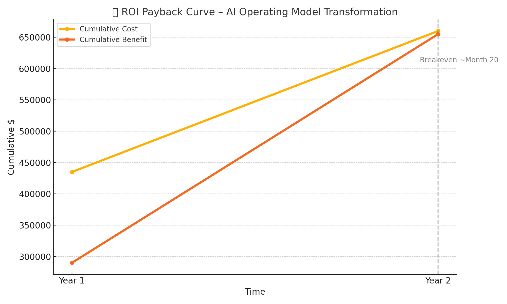
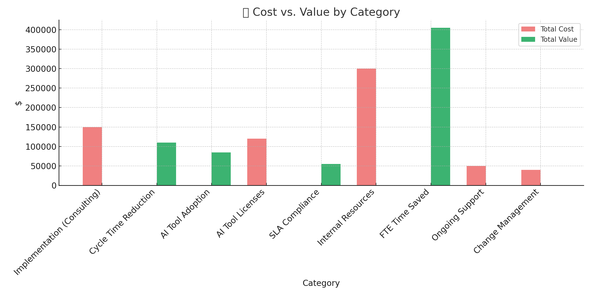
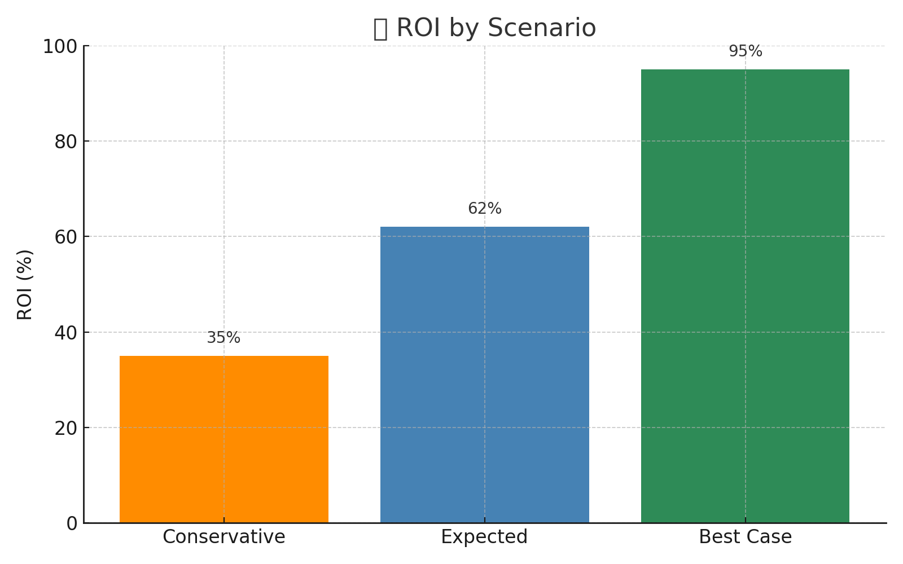

# 💼 10_Business_Case – Financial Model & ROI

This folder presents the financial justification for the AI-enabled operating model transformation. It models the total investment required, quantifies expected value creation, and visualizes return-on-investment (ROI) across multiple scenarios to support informed decision-making.

---

## 📌 Purpose

- Evaluate cost vs. value of the proposed transformation
- Calculate ROI, net benefit, and breakeven timing
- Communicate risk-adjusted value through visuals and scenario planning

---

## 💰 Cost Categories

| Category | Description |
|----------|-------------|
| **AI Tool Licenses** | Licensing or subscriptions for AI platforms (e.g. UiPath, Azure OpenAI, DataRobot) |
| **Implementation (Consulting)** | Setup, integration, and vendor enablement (e.g. Accenture, SEI) |
| **Change Management** | Communication strategy, training, and adoption support |
| **Internal Resources** | Internal FTE allocation from Ops, Risk, IT, HR |
| **Ongoing Support** | Post-launch tuning, retraining, and AI monitoring |

---

## 📈 Value Streams

| Benefit Type | Description |
|--------------|-------------|
| **FTE Time Saved via Automation** | Productivity gains from workflow automation |
| **Cycle Time Reduction** | Faster throughput across high-volume processes |
| **SLA Compliance Gains** | Fewer delays or rework costs |
| **AI Tool Adoption** | Improved efficiency through higher adoption of smart tools |

---

## 📊 Key Visuals

---

###   
📈 *This curve shows when cumulative benefits from the AI transformation surpass total investment. Breakeven occurs around Month 20, signaling strong ROI in Year 2.*

---

###   
💰 *Side-by-side comparison of where money is invested (cost inputs) vs. where it’s saved or gained (value streams). Useful for executive decision-making and prioritization.*

---

###   
📊 *Projected ROI across conservative, expected, and best-case scenarios. This view supports risk-informed planning and helps build confidence in business case resilience.*

---

## 📄 Files Included

| File | Description |
|------|-------------|
| `business_case_updated.xlsx` | Financial model with ROI, payback, and assumptions |
| `ROI_Payback_Curve.png` | Visual of cumulative investment vs. value over time |
| `Cost_vs_Value_by_Category.png` | Bar chart comparing total costs and benefits |
| `ROI_by_Scenario.png` | ROI forecast for conservative, expected, and best cases |
| `Scenario_Assumptions.md` *(optional)* | Written justification for model inputs and projections |

---

## 🔗 Related Folders

- 📁 `04_Data_Analysis` – Source of baseline productivity and volume metrics  
- 📁 `05_Design_Solutions` – Solution logic that drives FTE savings and cycle time improvements  
- 📁 `08_Impact_Measurement` – KPI definition and tracking aligned to model outputs  

---

> 💡 *Strong business cases are more than math. They create clarity, inspire action, and align stakeholders around shared value.*  
