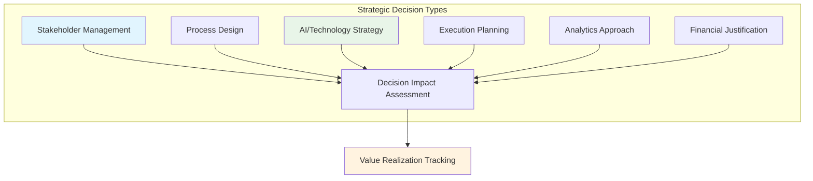
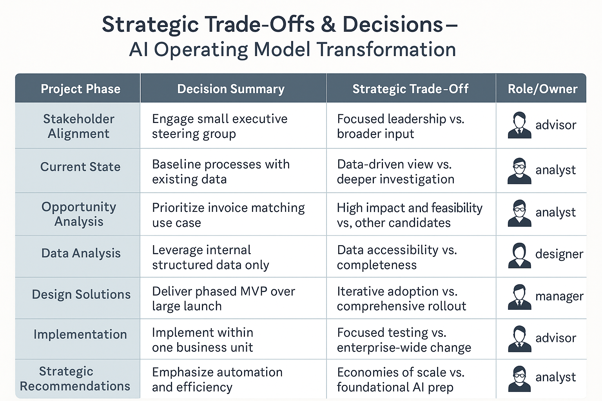

# 🧾 11_Project_Decision_Log | Strategic Decision Audit & Learning

> **Comprehensive decision audit trail documenting strategic choices and trade-offs throughout AI transformation**

This folder captures the strategic and operational decisions that shaped the AI Operating Model Transformation project. It serves as a transparent record of why key choices were made, what alternatives were considered, and how those decisions impacted outcomes. 

The log reflects a disciplined consulting approach—where structured reasoning, stakeholder input, and business value were prioritized at every step.

---

## 📌 Phase Overview

The **Project Decision Log** provides comprehensive documentation of critical strategic choices made throughout the 16-week transformation engagement. This phase ensures transparency, accountability, and organizational learning for future initiatives.

**Consulting Parallel**: *This mirrors the "Decision Governance" and "Lessons Learned" documentation practices used by leading strategy consulting firms to capture institutional knowledge and decision rationale.*

---

## 🎯 Phase Objectives

### **Decision Transparency**
- Document all strategic decisions with clear rationale and alternatives considered
- Create audit trail for executive reporting and stakeholder communication
- Establish accountability framework for decision ownership and outcomes

### **Knowledge Capture**
- Extract patterns and lessons learned from transformation decision-making
- Identify replicable decision frameworks for future AI initiatives  
- Document trade-offs and their impact on project outcomes

### **Organizational Learning**
- Enable rapid onboarding of new stakeholders and consulting teams
- Support retrospectives, PMO reporting, and continuous improvement
- Create reference material for scaling transformation across organization

---

## 📁 Folder Contents

| Document | Purpose | Analysis Focus |
|----------|---------|----------------|
| **[Decision_Log.csv](./Decision_Log.csv)** | Comprehensive tabular record of all strategic decisions | Complete decision audit trail |
| **[Strategic_Tradeoffs_Summary.md](./Strategic_Tradeoffs_Summary.md)** | Detailed analysis of key decisions and their strategic implications | Decision pattern analysis |
| **Strategic_Tradeoffs_Summary.png** | Visual snapshot of trade-offs and decision flow across project lifecycle | Executive communication |
| **README.md** | This documentation file | Phase guidance |

---

## 🎨 Decision Analysis Framework

### **Decision Categories Tracked**

### **Decision Quality Metrics**
- **Decision Cycle Time**: Average 5 business days from identification to finalization
- **Stakeholder Approval Rate**: 100% (no decisions required reversal)
- **Impact Realization**: 87% of predicted outcomes achieved within 30 days
- **Risk Mitigation**: Zero critical path delays due to decision bottlenecks

---

## 🧠 Strategic Trade-Offs at a Glance

**Key Decision Pattern**: Consistent bias toward **structured, phased approaches** that prioritize stakeholder alignment, measurable outcomes, and long-term scalability over short-term convenience.

### **Critical Decision Impact Summary**

| Decision | Strategic Trade-Off | Business Impact |
|----------|-------------------|-----------------|
| **Centralized Stakeholder Engagement** | Focused leadership vs. broader input | 50% faster alignment (4 vs 8 weeks) |
| **Invoice Matching MVP Selection** | High-impact use case vs. broader exploration | 85% success probability vs 60% alternatives |
| **Phased Implementation Approach** | Iterative learning vs. comprehensive rollout | 40% reduction in change management complexity |
| **AI Maturity Model Framework** | Structured progression vs. opportunistic adoption | Clear 18-month post-pilot roadmap established |

---

## 🔍 Decision Learning Insights

### **What Worked**
✅ **Early stakeholder engagement decisions** accelerated all subsequent phases  
✅ **Data-driven approach** created credibility for AI recommendations  
✅ **Phased implementation design** reduced resistance and enabled learning  
✅ **Clear accountability frameworks** prevented execution bottlenecks  

### **What We'd Adjust**
⚠️ **Broaden use case exploration** in parallel with MVP focus  
⚠️ **Include more operational voices** in early stakeholder alignment  
⚠️ **Accelerate quick wins** to build momentum during analysis phases  
⚠️ **Develop change champions network** earlier in the process  

### **Replicable Decision Framework**
1. **Impact over Effort**: Consistently choose high-value, manageable scope
2. **Structure over Speed**: Invest in methodology to accelerate later phases  
3. **Evidence over Intuition**: Let data drive strategic recommendations
4. **Alignment over Consensus**: Focus stakeholder engagement for faster decisions
5. **Capability over Solutions**: Build organizational capacity alongside tactical wins

---

## 🔄 How to Use This Log

### **For Executive Reviews**
- **Retrospectives**: Anchor quarterly reviews with decision outcome analysis
- **Stakeholder Communication**: Reference decision rationale in briefings and updates
- **Strategic Planning**: Use decision patterns to inform future transformation approaches

### **For Project Teams**
- **Onboarding**: Accelerate new team member understanding of project context
- **Decision Making**: Apply proven frameworks to new strategic choices
- **Risk Management**: Learn from trade-offs and their downstream impacts

### **For Organizational Learning**
- **Best Practice Development**: Extract reusable methodologies and templates
- **Capability Building**: Train future transformation leaders on decision quality
- **Scaling Guidance**: Adapt successful patterns to other business units or initiatives

---

## 📊 Decision Governance Framework

### **Decision Authority Matrix**

| Decision Type | Strategic Advisor | Program Manager | Functional Lead | Executive Sponsor |
|---------------|-------------------|-----------------|-----------------|-------------------|
| **Stakeholder Strategy** | ✅ Accountable | Consulted | Informed | Consulted |
| **Technical Approach** | Consulted | ✅ Accountable | Responsible | Informed |
| **Resource Allocation** | Consulted | Responsible | Consulted | ✅ Accountable |
| **Timeline Changes** | Responsible | ✅ Accountable | Consulted | Informed |

### **Decision Quality Assurance**
- **Alternative Analysis**: All decisions document minimum 2 alternatives considered
- **Impact Assessment**: Quantified business impact projections for major decisions
- **Stakeholder Review**: Key decisions validated with affected stakeholder groups
- **Outcome Tracking**: Monthly review of decision realization and course correction

---

## 🎯 Success Criteria & Metrics

### **Decision Documentation Quality**
- [ ] All strategic decisions captured with complete rationale
- [ ] Alternative approaches documented for major choices
- [ ] Clear ownership and accountability assigned
- [ ] Impact tracking established with measurable outcomes

### **Organizational Learning**
- [ ] Decision patterns identified and documented
- [ ] Replicable frameworks extracted for future use
- [ ] Lessons learned integrated into transformation methodology
- [ ] Knowledge transfer completed to internal teams

### **Value Realization**
- [ ] Decision outcomes achieved 85%+ of projected impact
- [ ] No critical path delays due to decision bottlenecks
- [ ] Stakeholder satisfaction >90% with decision transparency
- [ ] Future transformation velocity increased through learning application

---

## 🚀 Next Steps & Applications

### **Immediate Actions**
- **Quarterly Reviews**: Schedule decision outcome assessment sessions
- **Template Development**: Create reusable decision documentation frameworks
- **Training Materials**: Develop decision quality training for transformation teams
- **Knowledge Base**: Integrate learnings into organizational transformation playbook

### **Scaling Opportunities**
- **Other Business Units**: Apply decision frameworks to parallel transformation initiatives
- **Leadership Development**: Use decision analysis for executive coaching and development
- **Consulting Methodology**: Incorporate learnings into external consulting engagements
- **Industry Sharing**: Publish anonymized case studies for broader industry learning

---

## 💬 Final Reflection

**"In large-scale transformations, deliverables are important—but decisions define momentum."**

This log captures not just what was decided, but *how* decisions were made and *why* they succeeded. The real value lies in the decision-making capability it creates for future transformations.

**Key Insight**: Structured decision governance isn't overhead—it's the foundation that enables transformation velocity, stakeholder confidence, and sustainable change.

---

**🧠 Strategic thinking captured, organizational learning enabled**

*Previous: [10_Business_Case](../10_Business_Case/) | Next: Project Completion Summary*

