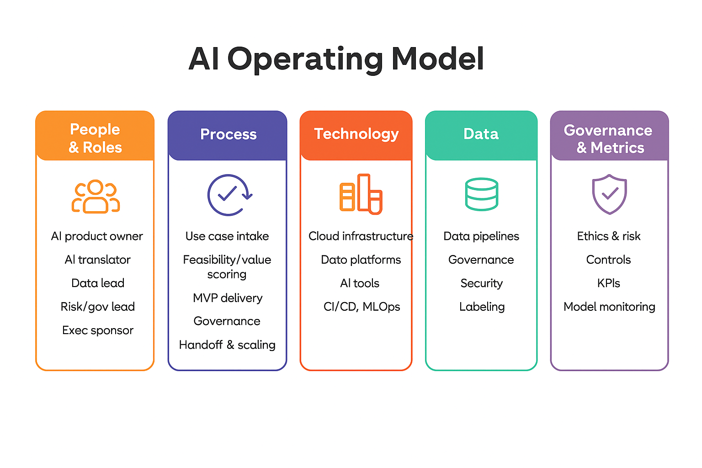

# 🧠 AI Operating Model Transformation

🧭 **TL;DR:** This GitHub simulates a real consulting engagement that redesigns an enterprise operating model using AI. Think **Bain meets automation** — with measurable ROI and structured delivery.

---

## 📌 Executive Summary

This repository presents a **self-directed consulting simulation** focused on transforming an enterprise operating model through **AI integration**. It mirrors the lifecycle of a real consulting engagement—covering stakeholder alignment, process analysis, AI opportunity identification, solution design, implementation planning, and impact measurement.  
AI is positioned as a **value accelerator**, embedded in a broader strategic transformation that enhances execution speed, decision-making, and operational resilience.

---

## 🎯 Project Goals

✅ Redesign the operating model for speed, clarity, and accountability  
✅ Identify automation opportunities with real ROI  
✅ Align stakeholders through structured influence mapping  
✅ Introduce data-informed decision-making at scale  
✅ Create a change roadmap balancing quick wins and long-term value  
✅ Define KPIs to track measurable impact and operational excellence

---

## 🗺️ Project Methodology

The repository is organized as a **full transformation lifecycle**, reflecting how a professional services firm would guide an enterprise client through AI-enabled operating model redesign.

| Folder | Title | Description |
|--------|-------|-------------|
| `00_Overview/` | Project Overview | Executive summary, methodology, and engagement structure |
| `01_Stakeholder_Alignment/` | Stakeholder Mapping & Engagement | Influence mapping, comms plans, stakeholder strategies |
| `02_Current_State/` | Process Analysis | Workflows, bottlenecks, root cause discovery |
| `03_Opportunity_Analysis/` | AI/Automation Value Targeting | Prioritization, feasibility, and use case development |
| `04_Data_Analysis/` | Data-Driven Insight Generation | Exploratory data visuals, trends, and readiness signals |
| `05_Design_Solutions/` | Solution Sketches & Frameworks | Journey maps, trigger logic, "before vs. after" models |
| `06_Implementation/` | Roadmap & Change Strategy | Timeline, RACI matrix, risks, change plans |
| `07_Strategic_Recommendations/` | Recommendation Narrative | Executive brief and synthesized final guidance |
| `08_Impact_Measurement/` | KPIs & Value Realization | Metrics, dashboards, and performance tracking |
| `09_AI_Tools/` | Automation & Experiment Log | Prompt libraries, low-code solutions, test outputs |
| `10_Business_Case/` | Financial Model & ROI | Cost-benefit logic, investment returns, payback periods |
| `11_Project_Decision_Log/` | Reasoning & Tradeoffs | Decision matrix, assumptions, rationale audit trail |

---

## 📂 Key Deliverables

- 📈 Visual frameworks and automation journey maps  
- 📊 Strategic dashboards and prioritization matrices  
- 🧭 RACI ownership model and implementation timeline  
- 📄 Final Strategic Recommendations Deck  
- ⚙️ Low-code tools, prompt tests, and experimental automations  
- 🧾 Decision Log CSV with rationale and trade-offs  

---

## 💼 Ideal Use Cases

- 👨‍💼 Hiring managers evaluating candidates for strategic, transformation, or analytics-driven roles  
- 🏢 Consultants or transformation leaders developing AI-enabled operating model frameworks  
- 👥 Peers or mentors seeking examples of case-based storytelling and structured problem solving  
- 🎓 Aspiring data and strategy professionals building end-to-end consulting project experience  

---

## 🧠 Why This Project Stands Out

- 🎯 Modeled after real-world consulting frameworks used by top firms  
- 🔄 Covers full project lifecycle from kickoff to ROI modeling  
- 🎨 Blends business strategy, process design, and data storytelling  
- 📊 Designed to be visually compelling and presentation-ready  
- 💼 Built for portfolio, interview storytelling, and team onboarding scenarios  

---

## 📬 Get in Touch

If you're interested in AI-driven transformation strategy, process design, or want to collaborate or provide feedback:

📧 **Ivana Gibson**  
🔗 [LinkedIn](https://www.linkedin.com/in/ivana-gibson) | 💻 [GitHub Profile](https://github.com/IVG12377)

---

## 🛡️ License

This project is licensed under the **MIT License** — see the [LICENSE](LICENSE) file for details.

---

<div align="center">

⭐ **Star this repository if you find it valuable for your transformation journey!**

</div>
# 🧠 AI Operating Model Transformation

[](LICENSE)
[](https://github.com/IVG12377/AI_Operating_Model_Transformation/stargazers)
[](#)

> 🧭 **TL;DR:** This GitHub simulates a real consulting engagement that redesigns an enterprise operating model using AI. Think **Bain meets automation** — with measurable ROI and structured delivery.

---

## 📌 Executive Summary

This repository presents a **self-directed consulting simulation** focused on transforming an enterprise operating model through **AI integration**. It mirrors the lifecycle of a real consulting engagement—covering stakeholder alignment, process analysis, AI opportunity identification, solution design, implementation planning, and impact measurement.

AI is positioned as a **value accelerator**, embedded in a broader strategic transformation that enhances execution speed, decision-making, and operational resilience.

### 🚀 What Makes This Project Unique
- 📊 **Consulting-Grade Methodology**: Mirrors frameworks from top-tier firms (Bain, McKinsey, BCG)
- 🎯 **End-to-End Lifecycle**: Complete transformation journey from discovery to value realization
- 💡 **Interactive Tools**: ROI calculator, stakeholder mapper, and automation scanner *(coming soon)*
- 📈 **Measurable Outcomes**: ROI-focused approach with defined KPIs and success metrics
- 🔄 **Real-World Application**: Templates and frameworks ready for actual implementation

---



---

## 🎯 Project Goals

✅ **Redesign** the operating model for speed, clarity, and accountability  
✅ **Identify** automation opportunities with real ROI  
✅ **Align** stakeholders through structured influence mapping  
✅ **Introduce** data-informed decision-making at scale  
✅ **Create** a change roadmap balancing quick wins and long-term value  
✅ **Define** KPIs to track measurable impact and operational excellence

---

## 🗺️ Project Methodology

The repository is organized as a **full transformation lifecycle**, reflecting how a professional services firm would guide an enterprise client through AI-enabled operating model redesign.

| Phase | Folder | Title | Description | Business Value |
|-------|--------|-------|-------------|----------------|
| **🎯 Foundation** | [`00_Overview/`](./00_Overview/) | Project Overview | Executive summary, methodology, engagement structure | Strategic alignment |
| **👥 Alignment** | [`01_Stakeholder_Alignment/`](./01_Stakeholder_Alignment/) | Stakeholder Mapping & Engagement | Influence mapping, comms plans, stakeholder strategies | Buy-in & adoption |
| **📋 Discovery** | [`02_Current_State/`](./02_Current_State/) | Process Analysis | Workflows, bottlenecks, root cause discovery | Baseline establishment |
| **💡 Analysis** | [`03_Opportunity_Analysis/`](./03_Opportunity_Analysis/) | AI/Automation Value Targeting | Prioritization, feasibility, use case development | Investment focus |
| **📊 Insights** | [`04_Data_Analysis/`](./04_Data_Analysis/) | Data-Driven Insight Generation | Exploratory visuals, trends, readiness signals | Evidence-based decisions |
| **🎨 Design** | [`05_Design_Solutions/`](./05_Design_Solutions/) | Solution Sketches & Frameworks | Journey maps, trigger logic, before/after models | Transformation blueprint |
| **🚀 Execution** | [`06_Implementation/`](./06_Implementation/) | Roadmap & Change Strategy | Timeline, RACI matrix, risks, change plans | Delivery certainty |
| **📈 Strategy** | [`07_Strategic_Recommendations/`](./07_Strategic_Recommendations/) | Recommendation Narrative | Executive brief, synthesized final guidance | Leadership clarity |
| **🎯 Measurement** | [`08_Impact_Measurement/`](./08_Impact_Measurement/) | KPIs & Value Realization | Metrics, dashboards, performance tracking | ROI validation |
| **⚙️ Enablement** | [`09_AI_Tools/`](./09_AI_Tools/) | Automation & Experiment Log | Prompt libraries, low-code solutions, test outputs | Capability demonstration |
| **💰 Justification** | [`10_Business_Case/`](./10_Business_Case/) | Financial Model & ROI | Cost-benefit logic, investment returns, payback | Investment approval |
| **📝 Knowledge** | [`11_Project_Decision_Log/`](./11_Project_Decision_Log/) | Reasoning & Tradeoffs | Decision matrix, assumptions, rationale audit trail | Institutional learning |

---

## 📂 Key Deliverables

| Category | Deliverable | Location | Impact |
|----------|-------------|----------|--------|
| 📈 **Strategic** | Visual frameworks and automation journey maps | `05_Design_Solutions/` | Clear transformation vision |
| 📊 **Analytical** | Strategic dashboards and prioritization matrices | `04_Data_Analysis/` | Data-driven decisions |
| 🧭 **Operational** | RACI ownership model and implementation timeline | `06_Implementation/` | Clear accountability |
| 📄 **Executive** | [Final Strategic Recommendations Deck](./07_Strategic_Recommendations/Strategic_Recommendations_Briefing_Deck.pdf) | `07_Strategic_Recommendations/` | Leadership guidance |
| ⚙️ **Technical** | Low-code tools, prompt tests, experimental automations | `09_AI_Tools/` | Capability proof points |
| 🧾 **Governance** | [Decision Log CSV](./11_Project_Decision_Log/Decision_Log.csv) with rationale and trade-offs | `11_Project_Decision_Log/` | Audit trail & learning |

---

## 🚀 Quick Start Guide

### 1. 📖 Explore the Methodology
1. Start with **[00_Overview](./00_Overview/)** for project context and framework  
2. Review **[Strategic Recommendations](./07_Strategic_Recommendations/)** for key insights  
3. Examine **[Decision Log](./11_Project_Decision_Log/)** for methodology rationale

### 2. 🎯 Follow the Transformation Journey
```mermaid
flowchart LR
    A[Overview] --> B[Stakeholder Alignment]
    B --> C[Current State]
    C --> D[Opportunity Analysis]
    D --> E[Data Analysis]
    E --> F[Design Solutions]
    F --> G[Implementation]
    G --> H[Strategic Recommendations]
    H --> I[Impact Measurement]

> 🧭 TL;DR: This GitHub simulates a real consulting engagement that redesigns an enterprise operating model using AI. Think Bain meets automation — with measurable ROI and structured delivery.

---

## 📌 Executive Summary

This repository presents a self-directed consulting simulation focused on transforming an enterprise operating model through **AI integration**. It mirrors the lifecycle of a real consulting engagement—covering stakeholder alignment, process analysis, AI opportunity identification, solution design, implementation planning, and impact measurement.

AI is positioned as a **value accelerator**, embedded in a broader strategic transformation that enhances execution speed, decision-making, and operational resilience.

---


---

## 🎯 Project Goals

- Redesign the operating model for speed, clarity, and accountability  
- Identify automation opportunities with real ROI  
- Align stakeholders through structured influence mapping  
- Introduce data-informed decision-making at scale  
- Create a change roadmap balancing quick wins and long-term value  
- Define KPIs to track measurable impact and operational excellence  

---

## 🗺️ Project Methodology

The repository is organized as a full transformation lifecycle, reflecting how a professional services firm would guide an enterprise client through AI-enabled operating model redesign.

| Folder | Title | Description |
|--------|-------|-------------|
| [`00_Overview/`](./00_Overview/) | Project Overview | Executive summary, methodology, and engagement structure |
| [`01_Stakeholder_Alignment/`](./01_Stakeholder_Alignment/) | Stakeholder Mapping & Engagement | Influence mapping, comms plans, stakeholder strategies |
| [`02_Current_State/`](./02_Current_State/) | Process Analysis | Workflows, bottlenecks, root cause discovery |
| [`03_Opportunity_Analysis/`](./03_Opportunity_Analysis/) | AI/Automation Value Targeting | Prioritization, feasibility, and use case development |
| [`04_Data_Analysis/`](./04_Data_Analysis/) | Data-Driven Insight Generation | Exploratory data visuals, trends, and readiness signals |
| [`05_Design_Solutions/`](./05_Design_Solutions/) | Solution Sketches & Frameworks | Journey maps, trigger logic, “before vs. after” models |
| [`06_Implementation/`](./06_Implementation/) | Roadmap & Change Strategy | Timeline, RACI matrix, risks, change plans |
| [`07_Strategic_Recommendations/`](./07_Strategic_Recommendations/) | Recommendation Narrative | Executive brief and synthesized final guidance |
| [`08_Impact_Measurement/`](./08_Impact_Measurement/) | KPIs & Value Realization | Metrics, dashboards, and performance tracking |
| [`09_AI_Tools/`](./09_AI_Tools/) | Automation & Experiment Log | Prompt libraries, low-code solutions, test outputs |
| [`10_Business_Case/`](./10_Business_Case/) | Financial Model & ROI | Cost-benefit logic, investment returns, payback periods |
| [`11_Project_Decision_Log/`](./11_Project_Decision_Log/) | Reasoning & Tradeoffs | Decision matrix, assumptions, rationale audit trail |

---

## 📂 Key Deliverables

- 📈 Visual frameworks and automation journey maps  
- 📊 Strategic dashboards and prioritization matrices  
- 🧭 RACI ownership model and implementation timeline  
- 📄 [Final Strategic Recommendations Deck](./07_Strategic_Recommendations/Strategic_Recommendations_Briefing_Deck.pdf)  
- ⚙️ Low-code tools, prompt tests, and experimental automations  
- 🧾 [Decision Log CSV](./11_Project_Decision_Log/Decision_Log.csv) with rationale and trade-offs  

---

## 💼 Ideal Use Cases

- **Hiring managers** evaluating candidates for strategic, transformation, or analytics-driven roles  
- **Consultants or transformation leaders** developing AI-enabled operating model frameworks  
- **Peers or mentors** seeking examples of case-based storytelling and structured problem solving  
- **Aspiring data and strategy professionals** building end-to-end consulting project experience

---

## 🧠 Why This Project Stands Out

- Modeled after **real-world consulting frameworks** used by top firms  
- Covers **full project lifecycle** from kickoff to ROI modeling  
- Blends **business strategy, process design, and data storytelling**  
- Designed to be **visually compelling and presentation-ready**  
- Built for **portfolio, interview storytelling, and team onboarding scenarios**

---

## 📬 Get in Touch

If you’re interested in AI-driven transformation strategy, process design, or want to collaborate or provide feedback:

📧 Ivana Gibson  
🔗 [LinkedIn](https://www.linkedin.com/in/ivana-gibson) | 💻 [GitHub Profile](https://github.com/IVG12377)

---

## 🛡 License

This project is licensed under the MIT License — see the [LICENSE](./LICENSE) file for details.
