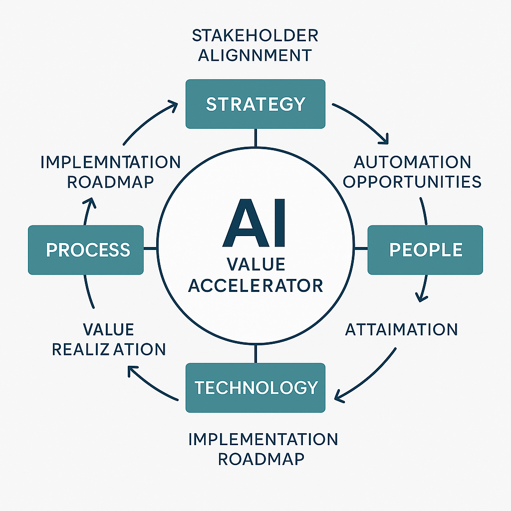

# 🧠 AI Operating Model Transformation

> 🧭 TL;DR: This GitHub simulates a real consulting engagement that redesigns an enterprise operating model using AI. Think Bain meets automation — with measurable ROI and structured delivery.

---

## 📌 Executive Summary

This repository simulates a high-impact consulting engagement focused on transforming an organization’s operating model through **AI integration**. It demonstrates structured methodologies for stakeholder alignment, current-state analysis, automation opportunity identification, solution design, implementation planning, and value realization.

AI is treated as a **value accelerator** — embedded within a broader strategic transformation that improves speed, decision-making, and execution quality.

---

---

## 🎯 Project Goals

- Redesign the operating model for speed, clarity, and accountability  
- Identify automation opportunities with real ROI  
- Align stakeholders through structured influence mapping  
- Introduce data-informed decision-making at scale  
- Create a change roadmap balancing quick wins and long-term value  
- Define KPIs to track measurable impact and operational excellence  

---

## 🗺️ Project Methodology

This project is organized like a real-world consulting engagement. Each folder reflects a specific transformation phase, from discovery to delivery:

| Folder | Title | Description |
|--------|-------|-------------|
| `00_Overview/` | Project Overview | Executive summary, methodology, and engagement structure |
| `01_Stakeholder_Alignment/` | Stakeholder Mapping & Engagement | Influence mapping, comms plans, stakeholder strategies |
| `02_Current_State/` | Process Analysis | Workflows, bottlenecks, root cause discovery |
| `03_Opportunity_Analysis/` | AI/Automation Value Targeting | Prioritization, feasibility, and use case development |
| `04_Data_Analysis/` | Data-Driven Insight Generation | Exploratory data visuals, trends, and readiness signals |
| `05_Design_Solutions/` | Solution Sketches & Frameworks | Journey maps, trigger logic, “before vs. after” models |
| `06_Implementation/` | Roadmap & Change Strategy | Timeline, RACI matrix, risks, change plans |
| `07_Strategic_Recommendations/` | Recommendation Narrative | Executive brief and synthesized final guidance |
| `08_Impact_Measurement/` | KPIs & Value Realization | Metrics, dashboards, and performance tracking |
| `09_AI_Tools/` | Automation & Experiment Log | Prompt libraries, low-code solutions, test outputs |
| `10_Business_Case/` | Financial Model & ROI | Cost-benefit logic, investment returns, payback periods |
| `11_Project_Decision_Log/` | Reasoning & Tradeoffs | Decision matrix, assumptions, rationale audit trail |

---

## 📂 Key Deliverables

- 📈 Visual frameworks and automation journey maps  
- 📊 Strategic dashboards and prioritization matrices  
- 🧭 RACI ownership model and implementation timeline  
- 📄 [Final Strategic Recommendations Deck](./07_Strategic_Recommendations/Strategic_Recommendations_Briefing_Deck.pdf)  
- ⚙️ Low-code tools, prompt tests, and experimental automations

---

## 💼 Ideal Use Cases

- **Hiring managers** evaluating candidates for strategic, transformation, or analytics-driven roles  
- **Consultants or leaders** running AI-powered operating model redesigns  
- **Peers or mentors** looking for case-based storytelling and structured problem solving  

---

## 🛡 License

This project is licensed under the MIT License — see the [LICENSE](./LICENSE) file for details.
