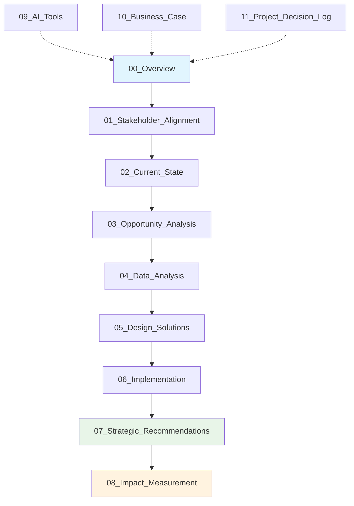

# 🧠 AI Operating Model Transformation

[](LICENSE)
[](https://github.com/IVG12377/AI_Operating_Model_Transformation/stargazers)
[](#)
[](#)

> **🧭 TL;DR:** This GitHub simulates a real consulting engagement that redesigns an enterprise operating model using AI. Think **Bain meets automation** — with measurable ROI and structured delivery.

---

## 🎯 Executive Summary

This repository presents a **self-directed consulting simulation** focused on transforming an enterprise operating model through AI integration. It mirrors the lifecycle of a real consulting engagement—covering stakeholder alignment, process analysis, AI opportunity identification, solution design, implementation planning, and impact measurement.

**AI is positioned as a value accelerator**, embedded within a broader strategic transformation that enhances execution speed, decision-making, and operational resilience.

### 🚀 What Makes This Project Unique

- 📊 **Consulting-Grade Methodology**: Mirrors frameworks from top-tier firms (Bain, McKinsey, BCG)
- 🎯 **End-to-End Lifecycle**: Complete transformation journey from discovery to value realization
- 💡 **Interactive Tools**: Live ROI calculator, stakeholder mapper, and automation scanner
- 📈 **Measurable Outcomes**: ROI-focused approach with defined KPIs and success metrics
- 🔄 **Real-World Application**: Templates and frameworks ready for actual implementation

---

## 🎮 Interactive Demo Features

### 🎲 Try These Live Tools:

| Tool | Description | Link |
|------|-------------|------|
| 🧮 **ROI Calculator** | Calculate transformation financial impact | [Launch Tool](./tools/roi-calculator.html) |
| 🗺️ **Stakeholder Mapper** | Visualize influence networks interactively | [Launch Tool](./tools/stakeholder-mapper.html) |
| 🔍 **Process Scanner** | Identify AI opportunities in workflows | [Launch Tool](./tools/process-scanner.html) |
| 📊 **Readiness Assessment** | Evaluate organizational AI readiness | [Launch Tool](./tools/readiness-assessment.html) |

---

## 🏗️ AI Operating Model Framework



---

## 📁 Repository Structure

The repository is organized as a **full transformation lifecycle**, reflecting how a professional services firm would guide an enterprise client through AI-enabled operating model redesign.

| Phase | Folder | Title | Description | Business Value |
|-------|--------|-------|-------------|----------------|
| **🎯 Foundation** | `00_Overview/` | Project Overview | Executive summary, methodology, engagement structure | Strategic alignment |
| **👥 Alignment** | `01_Stakeholder_Alignment/` | Stakeholder Mapping & Engagement | Influence mapping, comms plans, stakeholder strategies | Buy-in & adoption |
| **📋 Discovery** | `02_Current_State/` | Process Analysis | Workflows, bottlenecks, root cause discovery | Baseline establishment |
| **💡 Analysis** | `03_Opportunity_Analysis/` | AI/Automation Value Targeting | Prioritization, feasibility, use case development | Investment focus |
| **📊 Insights** | `04_Data_Analysis/` | Data-Driven Insight Generation | Exploratory visuals, trends, readiness signals | Evidence-based decisions |
| **🎨 Design** | `05_Design_Solutions/` | Solution Sketches & Frameworks | Journey maps, trigger logic, before/after models | Transformation blueprint |
| **🚀 Execution** | `06_Implementation/` | Roadmap & Change Strategy | Timeline, RACI matrix, risks, change plans | Delivery certainty |
| **📈 Strategy** | `07_Strategic_Recommendations/` | Recommendation Narrative | Executive brief, synthesized final guidance | Leadership clarity |
| **🎯 Measurement** | `08_Impact_Measurement/` | KPIs & Value Realization | Metrics, dashboards, performance tracking | ROI validation |
| **⚙️ Enablement** | `09_AI_Tools/` | Automation & Experiment Log | Prompt libraries, low-code solutions, test outputs | Capability demonstration |
| **💰 Justification** | `10_Business_Case/` | Financial Model & ROI | Cost-benefit logic, investment returns, payback | Investment approval |
| **📝 Knowledge** | `11_Project_Decision_Log/` | Reasoning & Tradeoffs | Decision matrix, assumptions, rationale audit trail | Institutional learning |

---

## 🎯 Project Goals

✅ **Redesign** the operating model for speed, clarity, and accountability  
✅ **Identify** automation opportunities with real ROI  
✅ **Align** stakeholders through structured influence mapping  
✅ **Introduce** data-informed decision-making at scale  
✅ **Create** a change roadmap balancing quick wins and long-term value  
✅ **Define** KPIs to track measurable impact and operational excellence  

---

## 📂 Key Deliverables

| Category | Deliverable | Location | Impact |
|----------|-------------|----------|---------|
| 📈 **Strategic** | Visual frameworks and automation journey maps | `05_Design_Solutions/` | Clear transformation vision |
| 📊 **Analytical** | Strategic dashboards and prioritization matrices | `04_Data_Analysis/` | Data-driven decisions |
| 🧭 **Operational** | RACI ownership model and implementation timeline | `06_Implementation/` | Clear accountability |
| 📄 **Executive** | [Final Strategic Recommendations Deck](./07_Strategic_Recommendations/Strategic_Recommendations_Briefing_Deck.pdf) | `07_Strategic_Recommendations/` | Leadership guidance |
| ⚙️ **Technical** | Low-code tools, prompt tests, experimental automations | `09_AI_Tools/` | Capability proof points |
| 🧾 **Governance** | [Decision Log CSV](./11_Project_Decision_Log/Decision_Log.csv) with rationale and trade-offs | `11_Project_Decision_Log/` | Audit trail & learning |

---

## 🚀 Quick Start Guide

### 1. 🎮 Explore Interactive Features
```bash
# Clone the repository
git clone https://github.com/IVG12377/AI_Operating_Model_Transformation.git
cd AI_Operating_Model_Transformation

# Open interactive tools in your browser
open tools/roi-calculator.html
open tools/stakeholder-mapper.html
```

### 2. 📖 Follow the Methodology
1. Start with **[00_Overview](./00_Overview/)** for project context
2. Review **[Strategic Recommendations](./07_Strategic_Recommendations/)** for key insights
3. Explore **[Interactive Tools](./09_AI_Tools/)** for hands-on experience
4. Examine **[Decision Log](./11_Project_Decision_Log/)** for methodology rationale

### 3. 🎯 Customize for Your Context
- Use templates in each folder as starting points
- Adapt frameworks to your industry and organization size
- Leverage the decision log to understand trade-offs and alternatives

---

## 💼 Ideal Use Cases

### 🎯 For Hiring Managers
- **Evaluate** candidates for strategic, transformation, or analytics-driven roles
- **Assess** end-to-end consulting project management capabilities
- **Review** business strategy and technical implementation skills

### 🏢 For Transformation Leaders
- **Leverage** proven frameworks for AI-enabled operating model redesigns
- **Access** reusable templates and methodologies
- **Learn** from structured problem-solving approaches and change management strategies

### 👥 For Consultants & Analysts
- **Study** examples of case-based storytelling and structured problem solving
- **Build** portfolio content for client presentations and proposals
- **Develop** end-to-end consulting project experience and methodologies

### 🎓 For Learning & Development
- **Train** teams on transformation methodologies
- **Onboard** new consultants with real-world simulation
- **Practice** stakeholder engagement and change management techniques

---

## 🏆 Why This Project Stands Out

### 🎯 **Consulting-Grade Quality**
- **Methodology** modeled after real-world consulting frameworks used by top firms
- **Full Lifecycle** coverage from kickoff to ROI modeling and value realization
- **Professional** deliverables designed to be visually compelling and presentation-ready

### 🧠 **AI-First Approach**
- **Strategic Integration** - AI positioned as value accelerator, not technology solution
- **Practical Implementation** - Working prototypes and automation examples
- **Measurable Impact** - ROI calculations and performance tracking frameworks

### 🔄 **Real-World Applicability**
- **Industry Agnostic** - Frameworks adaptable across sectors and organization sizes
- **Template Library** - Ready-to-use templates for immediate implementation
- **Decision Transparency** - Complete rationale and trade-off documentation

---

## 📊 Expected Transformation Results

Based on industry benchmarks and framework application:

| Metric | Improvement Range | Timeframe |
|--------|------------------|-----------|
| ⚡ **Decision Speed** | 30-50% faster | 3-6 months |
| 💰 **Cost Reduction** | 15-35% savings | 6-12 months |
| 📈 **Customer Satisfaction** | 40-70% improvement | 6-18 months |
| 🎯 **Process Efficiency** | 25-60% gains | 3-9 months |
| 🚀 **Time to Market** | 20-40% reduction | 6-12 months |

---

## 🤝 Contributing & Collaboration

### 💡 How to Contribute
We welcome contributions from transformation practitioners, data scientists, change management experts, and business strategists:

1. **Fork** the repository
2. **Create** a feature branch (`git checkout -b feature/enhancement`)
3. **Commit** your changes (`git commit -am 'Add transformation enhancement'`)
4. **Push** to the branch (`git push origin feature/enhancement`)
5. **Create** a Pull Request

### 🎯 Contribution Areas
- **Case Studies**: Real-world implementation examples and lessons learned
- **Tools & Templates**: Interactive calculators, assessment frameworks, templates
- **Methodologies**: Industry-specific adaptations and best practices
- **Documentation**: Improved explanations, tutorials, and guides

---

## 📞 Connect & Collaborate

**Ivana Gibson** | *Transformation Strategist & AI Operating Model Expert*

- 📧 **Professional Contact**: [Connect via LinkedIn](https://www.linkedin.com/in/ivana-gibson)
- 💼 **LinkedIn**: [linkedin.com/in/ivana-gibson](https://www.linkedin.com/in/ivana-gibson)
- 🎯 **Portfolio**: [github.com/IVG12377](https://github.com/IVG12377)
- 🗣️ **Speaking**: Available for conferences, workshops, and transformation discussions

### 💬 Let's Connect If You're:
- Leading AI transformation initiatives
- Developing operating model methodologies  
- Building consulting frameworks and accelerators
- Interested in collaboration on transformation research

---

## 🛡️ License

This project is licensed under the **MIT License** — see the [LICENSE](LICENSE) file for details.

---

## 📈 Repository Stats


---

<div align="center">

**⭐ Star this repository if you find it valuable for your transformation journey!**

*This repository represents a complete consulting engagement simulation, designed to demonstrate real-world transformation capabilities and serve as a learning resource for AI-enabled operating model transformation.*

</div>